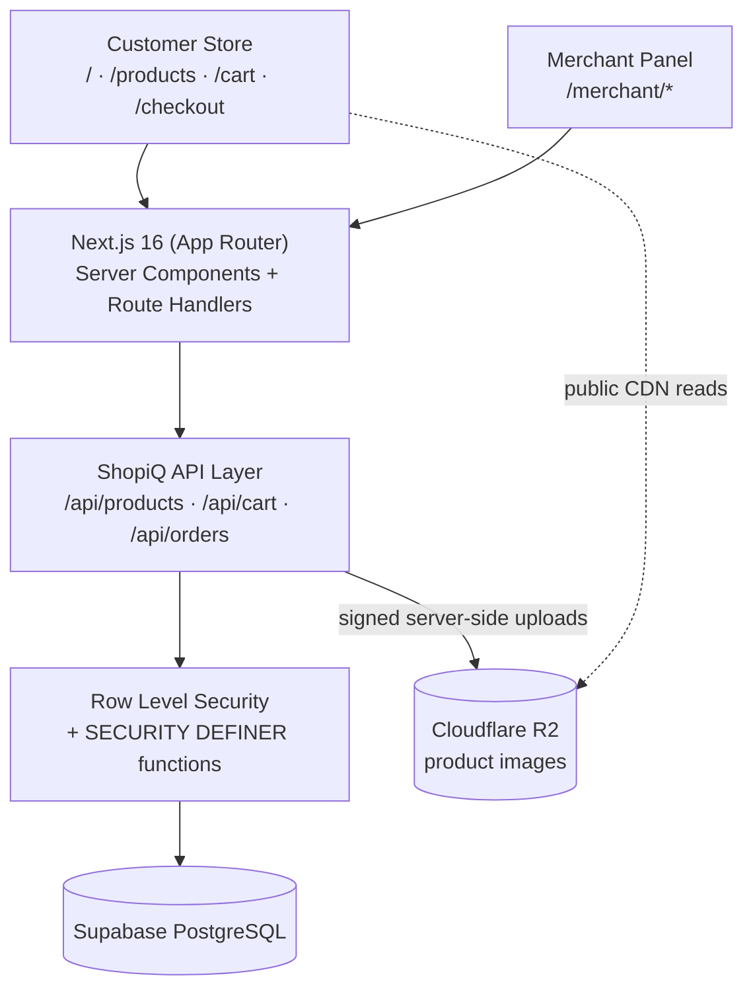
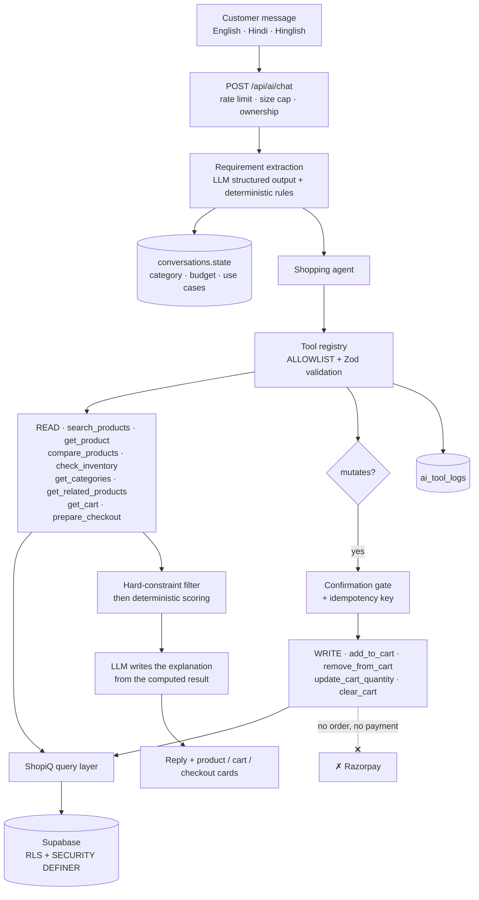
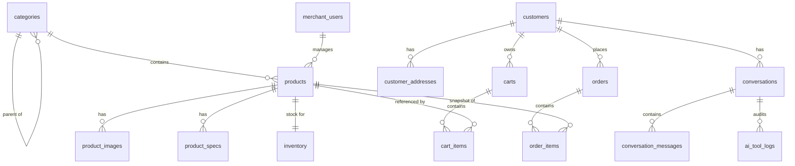
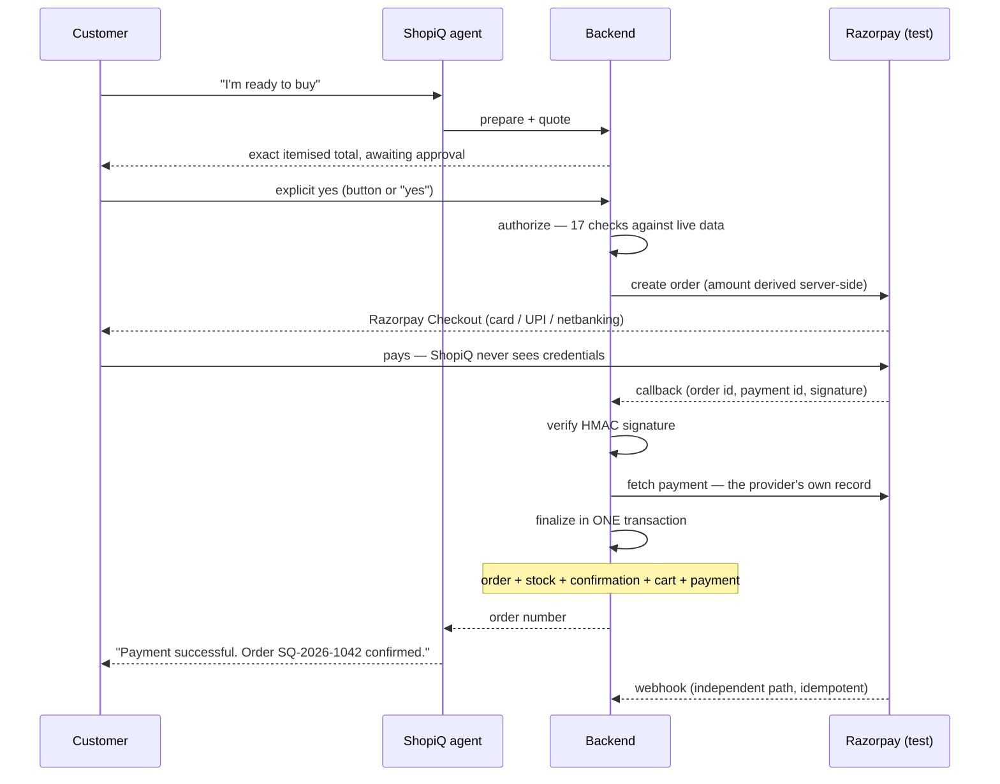

# ShopiQ

**Don't search for what to buy. Just tell ShopiQ what you need.**


An AI commerce agent that understands a request in **English or Hindi**, spoken
or typed, finds real products, asks which variant you want, compares them,
builds the cart, and takes payment through Razorpay — with the customer
authorising every rupee.

**Version 1.0.0** · Live: [shopiq.yashgarg.co.in](https://shopiq.yashgarg.co.in) · Guide: [/guide](https://shopiq.yashgarg.co.in/guide) · Contact: `shopiq@yashgarg.co.in`

Open source under the [MIT Licence](LICENSE). Originally built for the
**Razorpay AI Buildathon** — track: *AI Growth & Agentic Commerce*.

```
"Mujhe programming aur gaming ke liye laptop chahiye, budget around 80k hai."
                              ↓
   understand → search → recommend → compare → cross-sell → cart
                              ↓
        checkout → explicit authorization → Razorpay → verify
                              ↓
              order → inventory → audit → measured revenue
```

**[Try it](https://shopiq.yashgarg.co.in)** ·
**[How it works, with screenshots](https://shopiq.yashgarg.co.in/guide)** ·
**[Run it locally](#local-development)** ·
**[Contributing](CONTRIBUTING.md)** ·
**[Architecture](docs/architecture.md)** ·
**[Security](SECURITY.md)**

### Quick start

```bash
git clone https://github.com/yashgargdev/ShopiQ.git
cd ShopiQ && npm install
cp .env.example .env.local     # fill in a Supabase URL and keys
npm run dev
```

No AI account and no Razorpay account are needed to develop: without an AI key
the assistant falls back to a deterministic provider, and `npm run dev:mock`
simulates payments end to end. Full setup in
[Local development](#local-development).

---

## The problem

Search boxes make the customer do the translation. You know you need *a laptop
for programming and some gaming, around ₹80,000, not too heavy* — and the site
makes you turn that into a category, three filter checkboxes and a price slider,
then compare specification tables yourself.

Merchants have the mirror problem. They can see that a visitor searched and
left, but not what the visitor actually meant, and not whether a recommendation
earned anything.

## The solution

ShopiQ is one agent with two front doors — text and voice — that does the
translation itself, then acts:

- **For customers:** describe the need, get real products with real reasons,
  compare them, add to the cart, and pay. All in one conversation, in the
  language you actually speak.
- **For merchants:** every recommendation the AI showed is recorded and followed
  through to the rupee, so "did the AI make money" has an answer rather than an
  anecdote.

## Why AI — and where it stops

The interesting question is not whether an LLM can shop. It is what happens when
it is wrong.

**The model never picks, ranks, or prices a product.** It does two jobs: turn a
sentence into a structured requirement object, and write prose about a result
that was already decided. Filtering, scoring, stock, totals and money are
ordinary TypeScript and SQL.

That is why ShopiQ can say it does not hallucinate commerce facts — not because
the prompt asks nicely, but because there is no code path in which a
model-produced number becomes a price or a charge. And it is why adding voice in
Phase 5 required no change to any commerce code: a spoken *"haan, kar do"*
clears exactly the same seventeen checks a clicked button does.

---

## Status

**v1.0.0 — all eight phases built and tested.**

| Phase | Scope | |
| --- | --- | --- |
| 1 | Storefront, catalogue, cart, checkout, orders, merchant panel | ✅ |
| 2 | AI provider abstraction, tool registry, extraction, recommendation engine | ✅ |
| 3 | Agentic cart, references, confirmation, cross-sell, checkout preparation | ✅ |
| 4 | Razorpay test mode, purchase confirmation, verification, webhooks, orders | ✅ |
| 5 | Sarvam voice, shared conversation, structured visual responses | ✅ |
| 6 | Evaluation, revenue attribution, merchant insights, audit UI, hardening | ✅ |
| 7 | Full-screen voice agent, guest checkout, OTP accounts, invoices | ✅ |
| 8 | Bilingual replies, product variants, dedicated account pages | ✅ |

929 automated checks across 15 suites. See [Testing](#testing).

The catalogue holds **18 real products** across smartphones, laptops, gaming
laptops, controllers and headphones — seeded from `Products/` by
[`scripts/seed-real-catalog.mjs`](scripts/seed-real-catalog.mjs), with every
image served from Cloudflare R2.

---

## Tech stack

| Layer | Choice |
| --- | --- |
| Frontend | Next.js 16 (App Router), React 19, TypeScript |
| Styling | Tailwind CSS v4 (CSS-first `@theme` tokens) |
| API | Next.js Route Handlers |
| Database | Supabase PostgreSQL 17 |
| Auth | Supabase Auth (`@supabase/ssr`) |
| Object storage | Cloudflare R2 (S3 API via `@aws-sdk/client-s3`) |
| Validation | Zod 4 |
| AI provider | Claude (`@anthropic-ai/sdk`) or Sarvam — pluggable, optional |
| Hosting | Vercel-compatible |
| *Phase 3* | Sarvam voice, Razorpay |

The design comes from the Claude Design project `ShopiQ.dc.html` and is preserved as the source of
truth: pitch-black ground, one orange gradient (`#FFB65C → #F7931E → #DE6A0C`), Geist and Geist
Mono, hairline borders, the `glowdrift` and `pulsering` animations. Tokens live in
[`app/globals.css`](app/globals.css).

---

## Architecture



### The AI layer



Two properties do the heavy lifting:

**The model never picks a product.** Filtering, scoring and ranking are ordinary TypeScript in
[`lib/ai/recommend/engine.ts`](lib/ai/recommend/engine.ts). The LLM does exactly two jobs — turn a
sentence into a structured requirement object, and write prose about a result that was already
decided. Every factual claim in that prose is a value the engine read out of the catalogue.

**The model never gets database access.** It can only ask the tool registry to run one of twelve
named tools; the registry decides whether anything runs. There is no service-role key and no SQL in
reach. The four write tools that do exist can only touch **the caller's own cart**, take no price
and no customer id, and are joined by no order tool and no payment tool at all.

### Repository layout

```
shopiq/
├── app/
│   ├── layout.tsx                   Document shell only — no chrome
│   ├── (storefront)/                Shopper shell: header, footer, cart, AI panel
│   │   ├── layout.tsx
│   │   ├── page.tsx                 Homepage: hero, AI preview, categories, featured
│   │   ├── products/  categories/  search/
│   │   ├── cart/  checkout/  orders/  account/
│   │   └── login/  signup/
│   ├── merchant/
│   │   ├── access/                  "not a merchant" page — outside the guarded group,
│   │   │                            so its own guard cannot redirect to itself
│   │   └── (dashboard)/             Merchant shell: side rail, no cart, no AI button
│   │       └── products/ inventory/ orders/ analytics/
│   └── api/
│       ├── ai/chat/                 the ONE public AI entry point
│       ├── ai/status/               is a model configured?
│       ├── products/  categories/  cart/  orders/
│       ├── merchant/                products, inventory, orders, analytics, image upload
│       └── media/[...key]/          R2 proxy fallback when the bucket is private
├── components/
│   ├── ai/          AskShopiQ.tsx (entry points + panel) · AiChat.tsx (conversation)
│   │                AiCartCard.tsx (cart · checkout · confirmation cards)
│   └── ui/ layout/ products/ cart/ checkout/ merchant/ auth/
├── lib/
│   ├── ai/
│   │   ├── provider/     types.ts (the interface) · anthropic.ts · sarvam.ts · index.ts
│   │   ├── tools/        registry.ts (allowlist) · schemas.ts · implementations.ts
│   │   ├── requirements/ rules.ts (deterministic) · extract.ts (LLM + merge)
│   │   ├── tools/        cart.ts (the six cart tools — no identity, no prices)
│   │   ├── recommend/    engine.ts (constraints + scoring, no model involved)
│   │   ├── conversation/ store.ts
│   │   ├── references.ts "the second one" / "the cheaper one" → a real product id
│   │   ├── confirm.ts    pending actions, TTL, strict yes/no reading
│   │   ├── crosssell.ts  deterministic accessory pairing + relevance scoring
│   │   ├── cart-actions.ts  the cart turn handlers
│   │   ├── agent.ts      orchestrator
│   │   └── rate-limit.ts
│   ├── checkout/   prepare.ts (priced preview — creates no order, no payment)
│   ├── supabase/   server.ts (RLS) · admin.ts (service role) · client.ts (browser)
│   ├── r2/         client.ts · upload.ts (validation, safe keys)
│   ├── products/   cart/   orders/   merchant/   validation/   api/
│   └── auth.ts     format.ts
├── types/
├── supabase/
│   ├── migrations/ 0001 schema · 0002 RLS · 0003 functions · 0004 privileges ·
│   │               0005 AI conversations · 0006 spec filters · 0007 agentic cart ·
│   │               0008 image attribution
│   └── seed/       catalog.mjs (62 products)
├── scripts/        seed.mjs · check-r2.mjs · fetch-product-images.mjs ·
│                   smoke-test.mjs · test-auth-flow.mjs ·
│                   visual-check.mjs · test-ai-{unit,provider,tools,chat,ui}.mjs ·
│                   test-cart-{unit,tools,ui}.mjs
└── proxy.ts        session refresh + route gating (Next 16 convention)
```

The two route groups are the reason the merchant panel doesn't wear a cart badge:
`app/layout.tsx` carries only `<html>` and `<body>`, and each half supplies its own frame.

---

## Database schema



### Rules the schema enforces

**Money is never a string.** `price numeric(12,2)` plus `currency char(3)`. `79999` and `INR`, never
`"₹79,999"`. Formatting happens once, in [`lib/format.ts`](lib/format.ts).

**Specifications are machine-readable.** `product_specs` is the source of truth (one row per spec,
with `spec_value_num` populated for numeric values), and a trigger keeps `products.specs` as a
JSONB mirror in exactly the shape an agent wants:

```json
{
  "processor": "AMD Ryzen 7 8845HS",
  "ram_gb": 32,
  "storage_gb": 1024,
  "storage_type": "SSD",
  "gpu": "NVIDIA RTX 4060 8 GB",
  "display_size": 15.6,
  "weight_kg": 2.2
}
```

Numbers stay numbers, so `ram_gb >= 16 AND weight_kg <= 2` is a real query, not string matching.

**Availability is derived, never written by a client.**

```sql
available integer generated always as (quantity - reserved_quantity) stored
constraint inventory_reserved_lte_quantity check (reserved_quantity <= quantity)
```

**Order lines are snapshots.** `order_items` stores `product_name`, `sku`, `brand`, `image_url` and
`unit_price` as they were at purchase. A historical total is never recomputed from today's price,
and `product_id` is `ON DELETE SET NULL` so removing a product cannot corrupt order history.

### Key tables

| Table | Notes |
| --- | --- |
| `categories` | Self-referencing tree. A category filter includes its children. |
| `products` | `search_vector tsvector` maintained by trigger; GIN indexes on `search_vector`, `specs`, `tags` and a trigram index on `name`. |
| `product_images` | R2 references only (`r2_key`, `public_url`). Partial unique index guarantees at most one primary image per product. `attribution` / `license` / `source_url` carry the credit that openly-licensed photography requires. |
| `product_specs` | Source of truth for specs; unique on `(product_id, spec_key)`. |
| `inventory` | One row per product, auto-created by trigger. |
| `customers` / `merchant_users` | Both keyed to `auth.users(id)`. A trigger mirrors new signups into `customers`. |
| `carts` / `cart_items` | Cart lines carry **no client price**. `price_at_add` is written by the server from `products.price` and is a *history* column — every total is recomputed from the live catalogue, never from it. |
| `orders` / `order_items` | `order_number` like `SQ-2026-1000` from a sequence. |
| `conversations` / `conversation_messages` | Chat state. `pending_action jsonb` holds the one destructive action awaiting a yes. |
| `ai_tool_logs` | Every tool call: name, arguments, status, duration. RLS on, **no policy** — unreadable by any browser role. |
| `ai_action_keys` | Idempotency keys for write tools. A replayed key returns the first result instead of acting twice. |
| `purchase_confirmations` | A customer's yes, bound to an exact cart by `cart_hash`, with an amount in paise and a ten-minute deadline. |
| `payments` | One row per payment attempt. Unique on `(provider, provider_order_id)` and `(provider, provider_payment_id)`. |
| `payment_events` | Append-only money-action audit trail. RLS on, **no policy** — unreadable by any browser role. |
| `webhook_events` | Provider event ids. The unique index is what makes a replayed webhook a no-op. |

### Database functions

| Function | Granted to | Purpose |
| --- | --- | --- |
| `search_products(...)` | anon, authenticated | Listing **and** search: filters, ranking, pagination and the total count in one round trip. |
| `get_catalog_facets(slug)` | anon, authenticated | Brand counts, category counts and the price range for the filter sidebar. |
| `get_products_stock(uuid[])` | anon, authenticated | Availability without exposing `reserved_quantity`. |
| `create_order_from_cart(...)` | **service_role only** | The only writer of `orders`. Locks inventory, re-reads prices, verifies stock, snapshots lines, reserves stock — one transaction. |
| `set_order_status(id, status)` | **service_role only** | Status change plus the matching inventory movement, atomically. |
| `merchant_dashboard_stats()` | **service_role only** | Real analytics figures. |
| `cart_add_item(...)` | **service_role only** | Locks the inventory row, re-reads the live price, clamps the quantity to what is actually available, and upserts the line — one transaction. |
| `cart_set_quantity(...)` | **service_role only** | The same lock-and-clamp path for a quantity change; `0` deletes the line. |
| `finalize_paid_payment(...)` | **service_role only** | Turns a verified payment into an order: creates the order, reserves stock, consumes the confirmation, clears the cart and captures the payment — one transaction, idempotent, and refusing a terminal payment. |

Mutating functions are granted to `service_role` alone, so they are reachable only from server-side
route handlers that have already checked authorisation.

`create_order_from_cart()` was **extended, not duplicated**, in Phase 4: it gained
`p_payment_status`, `p_payment_method` and `p_payment_reference`, all defaulted so the Phase 1
call still works. Adding parameters changes the signature, so the old one is dropped explicitly
rather than left behind as an overload — an ambiguous function is a security problem, not just a
nuisance. There is still exactly one implementation of "create an order".

`cart_add_item` and `cart_set_quantity` exist so that "check stock, then write" is a single locked
transaction rather than two racing statements. They take `SELECT … FOR UPDATE OF inventory`, so two
concurrent adds of the last unit cannot both succeed; the second one is clamped and says so. They
return a JSON outcome (`requestedTotal`, `appliedTotal`, `available`, `clamped`, `unitPrice`) which
is what lets the assistant say *"only 2 were left, so I added 2"* instead of silently doing something
different from what was asked.

### Search ranking

`search_products` matches on the OR-form of the query for recall, then ranks by a weighted blend:

```
ts_rank(OR-form)  +  3 × ts_rank(AND-form)  +  2.5 × category match  +  0.6 × name/brand match
```

The category term is what makes `laptop` return actual laptops rather than the *Laptop Backpack* —
a product whose name contains the word but whose category does not.

### Row Level Security

| Table | anon / authenticated | merchant |
| --- | --- | --- |
| `categories`, `products`, `product_images`, `product_specs` | read where `is_active` | full write |
| `inventory` | **no direct access** (via `get_products_stock()` only) | full read/write |
| `customers`, `customer_addresses` | own row only | — |
| `carts`, `cart_items` | own cart only (`customer_id = auth.uid()`) | — |
| `orders`, `order_items` | own orders only | read all, update status |

Guest carts carry `customer_id IS NULL` and are keyed by an opaque token in an **httpOnly** cookie.
No browser session can select them; only server code holding the service-role key touches them. On
sign-in the guest cart merges into the customer's cart and is retired.

---

## Environment variables

Copy [`.env.example`](.env.example) to `.env.local`. **Never commit `.env.local`** — it is
gitignored.

```env
# Safe in the browser — gated by RLS
NEXT_PUBLIC_SUPABASE_URL=https://your-project.supabase.co
NEXT_PUBLIC_SUPABASE_ANON_KEY=...

# SERVER ONLY — bypasses every RLS policy
SUPABASE_SERVICE_ROLE_KEY=...

# SERVER ONLY
R2_ACCOUNT_ID=...
R2_ACCESS_KEY_ID=...
R2_SECRET_ACCESS_KEY=...
R2_BUCKET_NAME=shopiq
R2_PUBLIC_URL=https://cdn.shopiq.yashgarg.co.in   # empty ⇒ serve via /api/media

NEXT_PUBLIC_SITE_URL=http://localhost:3000
NEXT_PUBLIC_SITE_NAME=ShopiQ
NEXT_PUBLIC_SUPPORT_EMAIL=shopiq@yashgarg.co.in
NEXT_PUBLIC_FREE_DELIVERY_OVER=999
NEXT_PUBLIC_DELIVERY_FLAT_RATE=79

# ---- AI (Phase 2). SERVER ONLY. All optional. ----
# anthropic | sarvam | none. Unset auto-detects from whichever key is present.
AI_PROVIDER=
ANTHROPIC_API_KEY=
SARVAM_API_KEY=
```

**Every AI variable is optional.** With none set, ShopiQ runs the assistant in deterministic mode:
the same tools, the same catalogue, the same scoring — templated wording instead of generated
wording. Nothing else in the store is affected.

`SUPABASE_SERVICE_ROLE_KEY`, `R2_SECRET_ACCESS_KEY`, `ANTHROPIC_API_KEY` and `SARVAM_API_KEY` are
read only by modules that begin with `import 'server-only'`, which makes it a **build error** to
import them into a client component. Verified against the built bundle: no key, no provider SDK and
no server module appears in `.next/static`.

> ⚠️ A file named `SMTP` containing a credential was present in the project root before scaffolding.
> It is listed in `.gitignore`. Rotate that credential and move it into `.env.local` if it is still
> in use.

---

## Local development

```bash
npm install
cp .env.example .env.local     # then fill in your values

npm run dev                    # http://localhost:3000
npm run build                  # production build
npm run typecheck              # tsc --noEmit
```

### Supabase setup

The migrations in `supabase/migrations/` are numbered and idempotent in order:

| File | Contents |
| --- | --- |
| `0001_init_schema.sql` | Extensions, tables, indexes, triggers |
| `0002_rls_policies.sql` | `is_merchant()` and every RLS policy |
| `0003_functions.sql` | Search, facets, stock, ordering, analytics |

Apply them with the Supabase SQL editor, or with the CLI:

```bash
supabase link --project-ref <your-ref>
supabase db push
```

**Granting merchant access.** Sign up through `/signup`, then promote the account:

```sql
insert into public.merchant_users (id, email, full_name, role)
select id, email, 'Your Name', 'owner' from auth.users where email = 'you@example.com'
on conflict (id) do update set is_active = true, role = 'owner';
```

Signing in again gives you `/merchant`.

### R2 setup

1. Create an R2 bucket named `shopiq`.
2. Create an API token with **Object Read & Write** on that bucket.
3. Either bind a custom domain (`cdn.shopiq.yashgarg.co.in`) and set `R2_PUBLIC_URL`, or leave
   `R2_PUBLIC_URL` empty to serve images through `/api/media/...` with the bucket private.

Verify the credentials and public delivery end to end:

```bash
node -r dotenv/config scripts/check-r2.mjs dotenv_config_path=.env.local
```

```
PUT   … ok
GET   … ok (110 bytes, image/svg+xml)
PUBLIC https://cdn.shopiq.yashgarg.co.in … HTTP 200 image/svg+xml
DELETE… ok
```

Uploads are validated by **content**, not by file extension: `detectImageType()` sniffs magic bytes
and only WebP, PNG, JPEG, AVIF and SVG are accepted, up to 5 MB. Object keys are built as
`products/{productId}/{safe-name}-{random}.{ext}` — the filename is stripped of path separators and
traversal, and the random suffix prevents a re-upload silently overwriting an image other rows
still reference.

> **Note on deletes.** Objects are written with `Cache-Control: public, max-age=31536000, immutable`,
> which is safe because a key is never reused for different bytes (hence the random suffix). The
> trade-off is that deleting an image removes it from the R2 origin and the database immediately,
> but Cloudflare's edge may keep serving a cached copy until the TTL expires. Nothing references it
> by then. Purge the edge cache if you need it gone at once.

### Seed data

```bash
node -r dotenv/config scripts/seed.mjs dotenv_config_path=.env.local
```

Seeds **19 categories and 62 products** with 628 typed specifications, opening stock, and one
generated cover image per product uploaded to R2. Safe to re-run — everything upserts on its
natural key. Pass `--skip-images` to seed without touching R2.

| Department | Categories |
| --- | --- |
| Electronics | Laptops, Smartphones, Headphones, Monitors, Keyboards, Mice |
| Gaming | Gaming Laptops, Controllers, Gaming Headsets, Gaming Accessories |
| Fashion | Shoes, T-Shirts, Jackets, Bags |
| Home | Home Accessories |

Specification sets are meaningful per category — laptops carry `processor`, `ram_gb`, `storage_gb`,
`gpu`, `display_size`, `weight_kg`, `battery_wh`; headphones carry `type`, `noise_cancellation`,
`battery_hours`, `bluetooth_version`, `water_resistance` — so Phase 2 demos have real ground to
stand on. One product is seeded out of stock and several are low-stock so those states are visible.

### Product photography

```bash
node -r dotenv/config scripts/fetch-product-images.mjs dotenv_config_path=.env.local --dry-run
node -r dotenv/config scripts/fetch-product-images.mjs dotenv_config_path=.env.local
```

The seed uploads a generated gradient cover per product. This script replaces those with real
photography from **Wikimedia Commons** — the one large image corpus that is both openly licensed
for reuse and reachable without an API key. Author, licence and source page are written to
`product_images.attribution` / `.license` / `.source_url`, because CC-BY and CC-BY-SA require the
credit. `--dry-run` prints the picks without writing anything; `--only <fragment>` narrows to one
product.

**It refuses more often than it accepts, on purpose.** A candidate is rejected unless it is a raster
photograph of plausible dimensions, does not name a competitor's brand, and names either the right
kind of product or this exact model. Variant-critical products (`MacBook Air` vs `MacBook Pro`,
`iPhone 16` vs `iPhone 13`) must match a required pattern. Anything below the score threshold keeps
its placeholder.

Title text cannot describe what is actually in the frame, so the picks were then reviewed by eye and
the misses — a trade-show booth for the LG monitor, a bare circuit board for the desk lamp, a band
photo for the Adidas shoe, a retail box for the G502 — are listed in `MANUAL_REJECT` and restored to
placeholders. **23 of 62 products carry real photographs; the other 39 keep the gradient.** A neutral
placeholder is a better storefront than a confidently wrong product shot.

Re-running the seed is still safe: it clears a product's image rows before writing its placeholder,
so it will not collide with the single-primary-image index. Re-running the seed *does* revert
photography, so run the fetcher after it.

### Site identity

The favicon, Apple touch icon, web manifest and social preview are generated
from the brand mark by [`scripts/generate-icons.mjs`](scripts/generate-icons.mjs):

```bash
node scripts/generate-icons.mjs
```

The outputs (`app/icon.png`, `app/apple-icon.png`, `app/favicon.ico`,
`app/opengraph-image.png`) are **committed** — a deploy must not depend on the
CDN being reachable at build time. Next.js picks all four up by filename, so
no `metadata.icons` declaration is needed; adding one would emit the tags
twice.

One detail worth knowing if you replace the logo: the source mark has no alpha
channel, and the area outside its rounded corners is solid black. Shipped
as-is, every browser tab shows black triangles in the icon's corners. The
script cannot simply key out black — the shopping cart in the middle is black
too — so it flood-fills inward from the four corners instead. The corner black
is connected to the edge; the cart is enclosed by orange and is never reached.
That derives the real silhouette from the artwork rather than guessing a corner
radius, so it stays correct if the mark is redrawn.

---

## Deploying to Vercel

The app is a standard Next.js App Router project — no adapter, no custom build
step.

```bash
npm i -g vercel
vercel link
vercel --prod
```

Or import `github.com/YashGargDev/ShopiQ` from the Vercel dashboard and accept
the detected framework preset.

### Region

[`vercel.json`](vercel.json) pins functions to **`bom1` (Mumbai)**. This is not
cosmetic: the Supabase project runs in `ap-south-1`, and Sarvam is an Indian
provider. Defaulting to a US region would put a trans-continental round trip in
front of every database query on a request path that already waits on a model.

### Function duration

The slow routes declare their own limits, because a platform default shorter
than a model call surfaces to the shopper as a dead microphone rather than as
an error anyone can act on:

| Route | `maxDuration` | Waits on |
| --- | --- | --- |
| `/api/ai/chat` | 60 s | Extraction, tools, prose, translation |
| `/api/voice/transcribe` | 60 s | Sarvam STT |
| `/api/voice/synthesize` | 60 s | Sarvam TTS |
| `/api/agent/checkout` | 60 s | Quote, reverse geocode, invoice mail |
| `/api/payments/webhook` | 30 s | Razorpay → order finalisation |

The webhook is additionally pinned to `runtime = 'nodejs'` and
`dynamic = 'force-dynamic'`. Its signature is an HMAC over the exact request
bytes, and leaving the runtime implicit invites a future edge migration to
change body handling underneath the one check standing between a stranger and a
"payment succeeded" record.

### Environment variables

Set these in **Project → Settings → Environment Variables**. The full annotated
list is in [`.env.example`](.env.example); these are the ones a deployment
actually needs:

| Variable | Required | Notes |
| --- | --- | --- |
| `NEXT_PUBLIC_SUPABASE_URL` | ✅ | Safe in the browser |
| `NEXT_PUBLIC_SUPABASE_ANON_KEY` | ✅ | Gated by RLS |
| `SUPABASE_SERVICE_ROLE_KEY` | ✅ | **Server only.** Bypasses every RLS policy |
| `NEXT_PUBLIC_SITE_URL` | ✅ | Your production URL. Invoice links and OG tags resolve against it |
| `R2_*` | ✅ | Product imagery. `R2_PUBLIC_URL` may be empty to proxy through `/api/media` |
| `SARVAM_API_KEY` | recommended | **Server only.** Chat and voice. Without it the agent degrades to deterministic mode |
| `RAZORPAY_KEY_ID` | for payments | Publishable; handed to the browser by the server |
| `RAZORPAY_KEY_SECRET` | for payments | **Server only.** Never prefix with `NEXT_PUBLIC_` |
| `RAZORPAY_WEBHOOK_SECRET` | for payments | **Server only** |
| `SMTP_*` | for email | Invoices and OTPs. Without it mail is queued, never falsely reported as sent |

Two that matter more than they look:

- **`NEXT_PUBLIC_SITE_URL`** — invoice emails and Open Graph tags resolve
  against it. `lib/email/template.ts` ignores loopback and private addresses,
  so leaving it at `localhost` produces mail with dead links rather than
  obviously broken ones.
- **`PAYMENTS_ALLOW_MOCK`** — leave it **unset**. With no Razorpay keys the
  payment layer falls back to a deterministic mock, and that fallback is
  refused in production unless this is explicitly `true`. A mock quietly
  standing in for a gateway is how a store ships goods nobody paid for.

Nothing server-side leaks into the bundle: every secret is read only in a module
that imports `server-only`, so an accidental client import fails the build
rather than shipping a key. `npm run test:security` asserts this against the
built output.

### After the first deploy

1. Point the webhook at the deployed URL — see
   [Razorpay webhook setup](#razorpay-webhook-setup).
2. Add the production origin to Supabase → Authentication → URL Configuration,
   or OTP sign-in will reject the redirect.
3. Check `/api/ai/status` reports the provider you expect and no secrets.

### What does *not* need configuring

`allowedDevOrigins` in [`next.config.ts`](next.config.ts) exists only so a phone
on the LAN can load dev-server JavaScript. It has no effect on a production
build, and does not need to list your deployed domain.

The `certificates/` directory and `npm run dev:https` are for local HTTPS only.
`getUserMedia` requires a secure context, so the microphone will not work over
plain `http://` on a LAN address — on Vercel this is moot, since every
deployment is HTTPS.

---

## API documentation

All responses are JSON. Errors share one shape:

```json
{ "error": { "code": "NOT_FOUND", "message": "Product not found.", "details": [] } }
```

| Code | HTTP |
| --- | --- |
| `BAD_REQUEST` / `VALIDATION_ERROR` | 400 |
| `UNAUTHORIZED` | 401 |
| `FORBIDDEN` | 403 |
| `NOT_FOUND` | 404 |
| `CONFLICT` / `INVENTORY_CONFLICT` | 409 |
| `PAYLOAD_TOO_LARGE` | 413 |
| `INTERNAL_ERROR` | 500 |

Database messages are never forwarded to the client — they leak table and constraint names.

### Public

#### `GET /api/products`

Query: `page`, `limit` (≤60), `category`, `brand` (csv), `minPrice`, `maxPrice`, `rating`,
`inStock`, `featured`, `sort`, `q`.
Sort: `relevance` · `price_asc` · `price_desc` · `rating` · `newest` · `discount`.

```
GET /api/products?category=laptops&maxPrice=80000&sort=price_asc
```

```json
{
  "products": [
    {
      "id": "…", "name": "TUF Gaming A15 (2025)", "slug": "tuf-gaming-a15-2025",
      "brand": "ASUS", "sku": "SQ-GLP-0001",
      "price": 79999, "compareAtPrice": 89999, "currency": "INR",
      "rating": 4.6, "reviewCount": 238,
      "specs": { "ram_gb": 32, "gpu": "NVIDIA RTX 4060 8 GB", "weight_kg": 2.2 },
      "category": { "id": "…", "name": "Gaming Laptops", "slug": "gaming-laptops" },
      "image": "https://cdn.shopiq.yashgarg.co.in/products/…/main.svg",
      "availability": { "available": 12, "inStock": true, "lowStock": false }
    }
  ],
  "pagination": { "page": 1, "limit": 20, "total": 62, "totalPages": 4,
                  "hasNextPage": true, "hasPreviousPage": false }
}
```

#### `GET /api/products/search?q=gaming+laptop`

Same filters and response as above, plus `"query"`. Searches name, brand, tags, category,
descriptions, and specification keys and values.

#### `GET /api/products/:id`

`:id` accepts a **UUID or a slug**. Returns the product with `category`, `images[]`,
`specifications[]` (typed — numbers stay numbers), `availability` and `related[]`.

#### `GET /api/products/:id/inventory`

```json
{ "productId": "…", "available": true, "quantity": 12, "lowStock": false }
```

Deliberately narrow — `reserved_quantity` and the reorder threshold stay server-side.

#### `GET /api/categories`

Active categories with product counts; parents include nested `children` and a rolled-up count.

### Cart — works for guests and signed-in customers

| Method | Route | Body |
| --- | --- | --- |
| `GET` | `/api/cart` | — |
| `POST` | `/api/cart/items` | `{ productId, quantity }` |
| `PATCH` | `/api/cart/items/:id` | `{ quantity }` (`0` removes) |
| `DELETE` | `/api/cart/items/:id` | — |
| `DELETE` | `/api/cart` | — |
| `POST` | `/api/cart/prepare-checkout` | — · a priced preview that creates nothing |

**No price is ever accepted from the client.** The bodies are `.strict()`: a request carrying
`price`, `total` or `currency` is rejected with **400**, not silently stripped — a stripped field
looks to the caller exactly like an accepted one, which is the wrong thing to teach a client.

Quantities are clamped to available stock rather than rejected, so adding a 13th of something with
12 in stock leaves 12 in the cart. The response says what happened, so the caller can tell a clamp
from a success.

`POST /api/cart/prepare-checkout` re-reads every price and stock level, returns a fully-priced
summary and an explicit `blockers` array, and includes `"creates_order": false` and
`"creates_payment": false` in the wire response. It is the same code path the AI's
`prepare_checkout` tool uses.

### /Agent-purchase — the voice shopping agent

A full-screen voice agent at **`/Agent-purchase`**. One orb, one microphone, and
products that appear only when the conversation produces them. No header, no
navigation, no product grid — it sits outside the `(storefront)` route group
precisely so it inherits none of that.

```
"Mujhe 50 hazaar ke andar laptop chahiye"
        ↓ speak → search → compare → add → cross-sell
"Proceed to checkout"
        ↓ name · email · phone · address, collected conversationally
"Your total is ₹86,990. Would you like to proceed to payment?"
        ↓ explicit yes
   Razorpay (test) → server verification → order → invoice → account
```

### Guest checkout, without weakening anything

**No account is needed to shop.** This was the hardest constraint in the phase,
because `customers.id` is a foreign key to `auth.users(id)` — an *order* cannot
exist without an account. So guest checkout does not mean "an order with no
customer". It means the customer never has to create one *before* shopping:

1. Contact and delivery details are collected into `guest_checkout_sessions`,
   bound to the **httpOnly guest-cart cookie**.
2. Payment is authorised against that session.
3. The account is created at finalization, immediately before the order row.
4. Supabase Auth sends a secure password-setup link.

**Identity is still never a parameter.** The guest path derives it from the
cookie exactly as the authenticated path derives it from the session, so a
caller still cannot name whose cart to charge. All seventeen Phase 4 checks run
unchanged; guest checkout adds an eighteenth (`GUEST_DETAILS_INCOMPLETE`)
rather than removing any.

An email that already belongs to an account is **linked, never re-created and
never sent a setup link** — anyone can type someone else's address into a voice
checkout, so treating that as proof of ownership would be an account-takeover
primitive.

### Voice, reused not rebuilt

The agent calls the same `/api/voice/transcribe`, `/api/ai/chat` and
`/api/voice/synthesize` the Phase 5 panel does, and the same tool registry
underneath. There is no second agent and no second cart. What is new here is
presentation and the checkout choreography.

Ten states, with illegal transitions refused rather than applied:
`idle · listening · transcribing · thinking · speaking · waiting_for_user ·
checkout · payment · success · error`.

Pressing the microphone while ShopiQ is speaking **interrupts it** and starts
listening in the same handler.

### Cross-selling in the conversation

After an add, the same reply carries the Phase 3 cross-sell ranking — real
accessories from real category pairings, scored on price proportionality,
availability and stated use case. They render under **"Goes well with this"**
with an Add button, so a laptop is followed by a sleeve and a backpack rather
than a generic "you may also like".

### What the agent cannot do

- Invent a price, a total, a stock level or a delivery date. The estimate is
  configuration (`DELIVERY_ESTIMATE_DAYS`), surfaced as such.
- Take an amount from the client. Both `/api/agent/checkout` and
  `/api/payments/create` are `.strict()` and have no amount field.
- Pay without a fresh, unexpired, cart-matched confirmation.
- Ask for or accept a card number, CVV, UPI PIN or OTP. Razorpay's own sheet
  collects those.
- Read your location silently. Geolocation is requested explicitly, and if it
  fails or is denied, the agent simply asks for the address.

### Emails

Written to `email_outbox` **before** sending, so a failure is visible and
retryable — and a failed invoice never rolls back a paid order. With no
`RESEND_API_KEY` configured, mail stays `queued`: honestly pending, never
reported as sent.

---

## Voice

| Method | Route | Body |
| --- | --- | --- |
| `POST` | `/api/voice/transcribe` | multipart: `audio` (WAV/MP3/OGG/WebM/FLAC/MP4), `conversationId?` |
| `POST` | `/api/voice/synthesize` | `{ text, conversationId?, language?, speaker? }` → audio bytes |

Transcription returns text and hands it back; it does **not** call the agent.
A voice endpoint that also does the shopping is the beginning of a second
agent, so the client posts the transcript to `/api/ai/chat` exactly as if it
had been typed.

```json
// POST /api/voice/transcribe → 200
{
  "conversationId": "…",
  "transcript": { "text": "mujhe laptop chahiye", "language": "hi-IN", "language_confidence": 0.91 },
  "latency": { "stt_ms": 3736 },
  "provider": "sarvam",
  "audio_retained": false
}
```

Synthesis returns the audio bytes directly rather than a URL, because there is
no URL — nothing is stored. A failure here is a **503 with
`text_still_valid: true`**: the words are already on screen, so only the voice
is missing.

### Checkout and payments — authentication required

| Method | Route | Body |
| --- | --- | --- |
| `POST` | `/api/checkout/confirm` | `{ action: "request" \| "grant" \| "cancel", confirmationId? }` |
| `GET` | `/api/checkout/confirm` | — · the caller's live confirmation, if any |
| `POST` | `/api/payments/create` | `{ confirmationId?, conversationId? }` |
| `POST` | `/api/payments/verify` | `{ razorpay_order_id, razorpay_payment_id, razorpay_signature }` |
| `POST` | `/api/payments/webhook` | Razorpay's raw body · signature-authenticated, no session |

**Look at what these bodies do not contain.** `/api/payments/create` has no `amount` field —
its schema is `.strict()`, so a request carrying one is a **400**, not a silent strip. The server
derives the amount from the live cart after re-validating prices, stock and the confirmation.
`/api/payments/verify` has no `status` field: a client can hand over identifiers to be checked,
but it cannot tell the server that a payment succeeded.

```json
// POST /api/payments/create → 200
{
  "payment": {
    "payment_id": "…", "provider": "razorpay",
    "key": "rzp_test_…",                 // the PUBLISHABLE key only
    "provider_order_id": "order_…",
    "amount": 8089800, "amount_display": "₹80,898", "currency": "INR",
    "reused": false
  }
}
```

```json
// POST /api/payments/create → 409 when the total moved
{
  "error": {
    "code": "CONFLICT",
    "message": "The price changed since you confirmed, so I need you to approve the new total.",
    "details": {
      "reason": "PRICE_CHANGED",
      "old_total_minor": 8089800, "new_total_minor": 8389800,
      "old_total_display": "₹80,898", "new_total_display": "₹83,898"
    }
  }
}
```

The webhook is the only route in ShopiQ with no session: Razorpay cannot hold one, so **the
signature is the authentication**. It reads the raw body before anything parses it — signature
verification is over exact bytes, and re-serialising parsed JSON changes them.

### Orders — authentication required

| Method | Route | Notes |
| --- | --- | --- |
| `GET` | `/api/orders` | The caller's own orders |
| `POST` | `/api/orders` | `{ contactEmail, contactPhone, shippingAddress, notes, saveAddress }` |
| `GET` | `/api/orders/:id` | RLS-scoped — another customer's id returns 404 |

`POST /api/orders` runs `create_order_from_cart()`: it locks the inventory rows, re-reads every
price from `products`, verifies stock, writes the order with snapshotted line items, reserves the
stock and converts the cart — all in one transaction. Insufficient stock returns **409
`INVENTORY_CONFLICT`** naming the product and what is actually left.

### Merchant — merchant authentication required

| Method | Route |
| --- | --- |
| `GET` `POST` | `/api/merchant/products` |
| `GET` `PATCH` `DELETE` | `/api/merchant/products/:id` (DELETE deactivates) |
| `POST` `DELETE` | `/api/merchant/products/:id/images` (multipart → R2) |
| `GET` `PATCH` | `/api/merchant/inventory` |
| `GET` | `/api/merchant/orders` |
| `GET` `PATCH` | `/api/merchant/orders/:id` |
| `GET` | `/api/merchant/analytics` |

### AI

| Method | Route | Notes |
| --- | --- | --- |
| `POST` | `/api/ai/chat` | `{ conversationId?, message }` — the only public AI entry point |
| `GET` | `/api/ai/chat?conversationId=` | Replay a conversation you own |
| `GET` | `/api/ai/status` | Whether a model is configured, which tools exist, and what they may do |

`GET /api/ai/status` reports the boundary explicitly, so a client never has to infer it:

```json
{
  "aiEnabled": true, "mode": "ai",
  "tools": [ … 16 … ], "writeTools": [ … 5 … ],
  "toolLevels": { "search_products": 1, "add_to_cart": 2, "create_payment": 4, … },
  "moneyTools": ["create_payment"],
  "requiresConfirmation": ["clear_cart"],
  "canPlaceOrders": false,
  "canTakePayment": true,
  "requiresExplicitPurchaseConfirmation": true,
  "autonomousPurchasing": false,
  "payments": { "provider": "razorpay", "configured": true, "testMode": true, "publicKeyPresent": true }
}
```

`canTakePayment` became `true` in Phase 4 and `canPlaceOrders` deliberately did not: the agent
can start a payment the customer approved, but an order only ever comes from server-side
verification.

```json
// POST /api/ai/chat
{ "message": "Mujhe college ke liye laptop chahiye, budget 80 hazaar" }
```

```json
{
  "conversationId": "…",
  "message": "I found 9 products matching your requirements. My top pick is the ASUS TUF Gaming A15…",
  "products": [
    {
      "productId": "…", "name": "TUF Gaming A15 (2025)", "brand": "ASUS",
      "price": 79999, "currency": "INR", "rating": 4.6,
      "available": true, "availableQuantity": 12, "lowStock": false,
      "score": 99,
      "matchReasons": ["₹79,999, within your ₹80,000 budget", "32 GB RAM suits programming"],
      "limitations": [],
      "keySpecs": { "gpu": "NVIDIA RTX 4060 8 GB", "ram_gb": 32 }
    }
  ],
  "comparison": null,
  "actions": [{ "type": "compare", "productIds": ["…", "…"] }],
  "outcome": "matches",
  "degraded": false
}
```

A turn that touched the cart adds a `cart` payload; a checkout turn adds `checkout`; a destructive
proposal adds `pendingAction`:

```json
{
  "outcome": "cart_updated",
  "message": "Added the ASUS TUF Gaming A15 — ₹79,999. Your cart is ₹79,999 for 1 item.",
  "cart": {
    "items": [{ "cartItemId": "…", "productId": "…", "name": "TUF Gaming A15 (2025)",
                "quantity": 1, "unitPrice": 79999, "lineTotal": 79999, "available": true }],
    "itemCount": 1, "subtotal": 79999, "shipping": 0, "tax": 0, "total": 79999,
    "currency": "INR"
  },
  "actions": [{ "type": "view_cart" }, { "type": "checkout" }]
}
```

```json
{
  "outcome": "awaiting_confirmation",
  "message": "That will remove all 3 items (₹84,497). Do you want me to clear the cart?",
  "pendingAction": { "action": "clear_cart", "summary": "Remove all 3 items (₹84,497)" },
  "actions": [{ "type": "confirm", "action": "clear_cart", "label": "Yes, do it" },
              { "type": "cancel",  "action": "clear_cart" }]
}
```

`outcome` is one of `matches`, `relaxed`, `empty`, `answer`, `clarify`, `error`, `cart_updated`,
`awaiting_confirmation`, `cancelled`, `checkout_ready`, `checkout_blocked`. **`relaxed` means
nothing satisfied every requirement** and the results are near misses — every one of them carries
its shortfall in `limitations`. The client must not present a `relaxed` result as a clean match.

`actions` is an open union: `compare`, `view_product`, `refine`, `add_to_cart`, `view_cart`,
`checkout`, `confirm`, `cancel`. **Every figure in `cart` and `checkout` is computed on the server**
from the live catalogue. The panel renders them; it never adds anything up itself, and the browser
tests assert the rendered rupee figure is byte-for-byte the API's.

---

## Language — English and Hindi

ShopiQ answers in whatever language the shopper used: English, Devanagari
Hindi, or romanised Hinglish. Say *"hindi mein baat karo"* and it switches;
say *"अब अंग्रेजी में बात करो"* and it switches back.

The interesting part is where the translation happens.

**Every fact is computed in English, and translated last.** Cart totals, order
statuses, payment outcomes and refusals are deterministic templates — they
never pass through the prose writers, so translating inside those writers would
have left the majority of replies stubbornly English. Instead
[`lib/ai/language.ts`](lib/ai/language.ts) wraps the single agent entry point,
so *every* reply path is covered by one step.

That step then **proves the numbers survived**:

```ts
if (!sameList(digitRuns(output), digitRuns(trimmed))) return text;
if (!sameList(identifiers(output), identifiers(trimmed))) return text;
```

Every digit run and every identifier — order numbers, SKUs — must match the
source exactly, or the English original is sent instead. A mistranslated
pleasantry is a small problem. A mistranslated price is a lie about money, and
this check is what makes that failure mode impossible rather than unlikely.

Detection is deterministic and sticky. Script is unambiguous evidence; a
curated marker list catches romanised Hindi while deliberately excluding words
that collide with English (`do`, `to`, `me`, `is`), so *"add the 2 TB one to my
cart"* is never read as Hindi. Once a language is established it persists in
the conversation state, because a one-word *"haan"* carries no evidence of its
own.

---

## Product variants

The catalogue models the two axes differently, because the source data does.

**Storage is a separate product.** *iPhone 17 256 GB* and *iPhone 17 512 GB*
are distinct rows with their own SKU, price and inventory. Choosing one is
choosing a product.

**Colour is not.** Every colour of a given storage size shares one SKU and one
stock figure. Choosing one records a preference on the line —
`cart_items.selected_options` — and is snapshotted onto `order_items` at
purchase, because the cart row is deleted and the choice exists nowhere else.

So "add an iPhone 17" is not yet an instruction a cart can execute. It is
parked, and the missing axis is asked for, one at a time:

```
Add iPhone 17  → The iPhone 17 comes in a few sizes. Which one would you like?
                 · 256 GB — ₹82,900
                 · 512 GB — ₹1,02,900
512 GB         → comes in 5 colours: Black, Lavender, Mist Blue, Sage, White
Sage           → Added iPhone 17 512 GB in Sage to your cart. Total ₹1,02,900.
```

Every option offered is read from the catalogue at the moment of asking — the
storage sizes are real products, the colours are derived from the images
actually uploaded to R2 — so the assistant cannot offer a variant ShopiQ does
not stock. A colour supplied to the tool layer is checked against that same
list and silently dropped if it is not on it, so a hallucinated *"Midnight
Green"* can never reach a cart line or an order.

`selected_options` participates in line identity: a Sage iPhone and a White one
are two cart lines, not one merged line.

---

## The AI layer

### Provider abstraction

[`lib/ai/provider/types.ts`](lib/ai/provider/types.ts) defines the whole contract:

```ts
interface AIProvider {
  readonly name: string;
  readonly available: boolean;          // false ⇒ callers degrade, not fail
  generateResponse(request): Promise<GenerateResult>;
  generateStructuredOutput<T>(request): Promise<T>;   // Zod-enforced
  executeToolCalls(request): Promise<ToolCallResult>; // bounded tool loop
}
```

Three implementations ship: `anthropic.ts` (Claude, using `messages.parse()` with a Zod output
format so extraction physically cannot return an unexpected shape), `sarvam.ts` (OpenAI-compatible
chat completions, validated with the same Zod schema), and a null provider.

`AI_PROVIDER` selects one; unset auto-detects from whichever key is present. **With no key at all,
ShopiQ runs in deterministic mode** — rule-based extraction and templated explanations over the
same catalogue data. Search, filtering, scoring and comparison are byte-identical; only the wording
changes. That is what makes Phase 2 §34 true rather than aspirational, and it is why the whole test
suite runs without an API key.

### The tools

Twelve, defined once in [`lib/ai/tools/registry.ts`](lib/ai/tools/registry.ts). Eight read, four
write, and **none of them can place an order or take a payment.**

**Read tools**

| Tool | Purpose |
| --- | --- |
| `search_products` | Free text, category, brand, price range, rating, stock, and **typed spec filters** (`{"ram_gb_min": 16, "gpu": "RTX 4060"}`) |
| `get_product` | Full record: description, price, rating, images, every spec, live stock, related |
| `compare_products` | 2–4 products, aligned rows, a winner per row where one exists |
| `check_inventory` | `{ product_id, available, quantity }` — and nothing else |
| `get_categories` | Active categories with counts, so the agent maps text onto a real slug |
| `get_related_products` | `same_category`, `same_brand`, or `accessories` from real relationships |
| `get_cart` | The caller's own cart, priced from the live catalogue |
| `prepare_checkout` | A validated, fully-priced checkout preview — creates nothing |

**Write tools** — all four touch the caller's own cart and nothing else

| Tool | Confirmation | Idempotent | Notes |
| --- | --- | --- | --- |
| `add_to_cart` | — | yes | `{ product_id, quantity }`. Clamped to live stock; reports the clamp. |
| `update_cart_quantity` | — | yes | `{ cart_item_id, quantity }`. `0` removes the line. |
| `remove_from_cart` | — | yes | `{ cart_item_id }`. Removing what is already gone is a success, not an error. |
| `clear_cart` | **required** | yes | Empties the cart. Never runs on the turn that proposes it. |

**What no tool takes, in any signature:** a price, a discount, a total, a `customer_id`, a
`cart_id`, or a SQL fragment. Identity is derived from the authenticated session inside the tool
implementation, so a model that emits `{"customer_id": "somebody-else"}` gets a schema rejection —
the field does not exist to be honoured. Prices come from `products`, every time.

A tool call runs only if the name is in the table **and** the arguments parse against that tool's
Zod schema. Everything else is rejected and written to `ai_tool_logs` with status `rejected`. The
same Zod schemas generate the JSON Schema the model sees, so its view and the enforcement cannot
drift apart. Write tools pass through two further gates before anything happens:

1. **Confirmation.** A tool marked `requiresConfirmation` will not execute unless the run context
   carries `confirmed: true`, which only a fresh human yes can set.
2. **Idempotency.** Write tools are keyed on `(conversation, tool, arguments)`. A retried turn — a
   double tap, a flaky connection, a model that repeats itself — replays the stored result instead
   of adding the laptop twice.

Spec filtering reaches the database through `search_products(… p_spec_filters jsonb)`, which
compares against the typed `products.specs` JSONB. A product that does not record the key never
matches, and a non-numeric value on a range comparison returns nothing rather than erroring.

### Requirement extraction

The model's reading and a deterministic rule pass both run on every message, then merge — and
**the rules win wherever they are confident**. A regex cannot invent a budget that is not in the
text; a model can.

| Input | Extracted |
| --- | --- |
| `under 80k` · `₹80,000` · `around 80 thousand` · `80 hazaar ke andar` · `80k tak` | `budget.max = 80000` |
| `budget is 75-80k` | `budget.min = 75000, max = 80000` |
| `nothing heavier than 2kg` · `2 kg se kam` | `{ weight_kg, lte, 2, hard }` |
| `at least 16GB RAM` | `{ ram_gb, gte, 16, hard }` |
| `must have an RTX 4060` | `{ gpu, contains, "RTX 4060", hard }` |
| `available now` · `abhi chahiye` | `requireInStock = true` |
| `lighter ones` · `thoda halka` | `preferences.portability = high` |

Anything not stated stays `null` or empty — never guessed.

### Recommendation scoring

Deterministic, in code, and fully explainable:

| Component | Weight |
| --- | --- |
| Budget match | 30 |
| Use-case match | 25 |
| Specification match | 20 |
| Preference match | 15 |
| Rating | 10 |

Hard constraints are enforced *before* scoring: an over-budget or out-of-stock product is excluded,
not down-ranked. When nothing survives, the engine relaxes the softest constraint, labels the result
`relaxed`, and names what it gave up. Every recommendation carries `matchReasons` and `limitations`
drawn from database values — the drawbacks are surfaced, not hidden.

### The no-hallucination rule

Four independent mechanisms, not a prompt instruction alone:

1. The model never selects products — the engine does, from rows it fetched.
2. Prose generation receives the already-chosen products as facts and is instructed to use only
   those; the system prompt forbids inventing a price, spec, rating or stock figure.
3. Hallucinated structure is discarded on merge: a category slug that is not in the catalogue, a
   brand that does not exist, a malformed spec key, an out-of-range rating, a negative budget.
4. The tests assert every returned product id, name and price against the database directly.

If a fact is not in the catalogue, the assistant says so rather than guessing.

### Conversational product references

*"Add the second one."* *"The cheaper one."* *"Remove the ASUS."* Resolution happens in
[`lib/ai/references.ts`](lib/ai/references.ts) — pure functions over the products the assistant
actually showed in this conversation, with no model involved:

| Said | Resolves against |
| --- | --- |
| `the first one` · `#2` · `the third` · `pehla` · `dusra` | position in the last result set |
| `the cheaper one` · `the cheapest` · `sabse sasta` | price across the last result set |
| `the ASUS` · `the TUF` | brand or name substring |
| `that one` · `it` · `wahi` | the single product currently in focus |

An ordinal that points past the end of the list, or a name matching two products, produces a
clarifying question — never a guess. **A reference can only resolve to a product the assistant
already showed the customer**, which is what keeps *"add the second one"* from becoming a way to
reach an arbitrary product id.

Quantity parsing shares the pass (`add two`, `make it 3`, `ek aur`). One case is worth naming: in
Hinglish `do` is both the number *two* and the imperative particle in *"cart mein daal do"*
("put it in the cart"). Reading that as *add 2* is wrong in a way the customer only finds out at
checkout, so an imperative `do` following a verb is explicitly not a number.

### Confirmation

Destructive actions do not run on the turn they are proposed.
[`lib/ai/confirm.ts`](lib/ai/confirm.ts) writes a `PendingAction` — the action, its validated
arguments, a human summary, and a timestamp — onto `conversations.pending_action`, and the turn
returns `awaiting_confirmation` with confirm and cancel actions. The action carries one of eight
states: `pending`, `awaiting_confirmation`, `confirmed`, `executing`, `completed`, `failed`,
`cancelled`, `expired`.

Three properties matter more than the mechanism:

- **Only a clear yes counts.** "yes", "haan", "go ahead", "do it", "confirm". Anything ambiguous —
  silence, a new question, "hmm", "maybe" — is *not* consent, and the pending action is dropped
  rather than carried forward into a turn where a later "yes" could land on it.
- **Arguments are frozen at proposal time.** The confirmation executes exactly what was described,
  not whatever the conversation has drifted to since.
- **Pending actions expire after five minutes.** A "yes" typed into a stale tab confirms nothing.

**A confirmation is an ordinary message.** There is no `confirm: true` field on the API; the
panel's "Yes, do it" button sends the words *"Yes, go ahead"* down the same path a typed yes takes.
That is deliberate — a separate confirmation channel would be a second way to authorise an action,
and the second way is the one that ends up under-tested.

Only `clear_cart` requires confirmation today. Adding one item is trivially reversible and gating it
would train customers to click through confirmations, which is how confirmations stop working.

### Cross-selling

After something is added, the assistant may suggest accessories — deterministically, from
[`lib/ai/crosssell.ts`](lib/ai/crosssell.ts), never from the model's idea of what goes together.
A hand-maintained pairing map (laptops → bags, mice, keyboards; phones → headphones, power banks)
supplies the candidates; five scored dimensions rank them:

| Dimension | Max | Why |
| --- | --- | --- |
| Relationship strength | 40 | How naturally the pairing follows from the anchor |
| Use-case fit | 20 | A gaming headset scores higher when gaming was stated |
| Price proportionality | 20 | ≤20% of the anchor scores full; costing *more* than the anchor is penalised |
| Availability | 10 | Out of stock is not a suggestion — it is excluded outright |
| Rating | 10 | Real catalogue rating |

Suggestions are gated, not automatic: nothing is suggested when the cart is being emptied, during a
confirmation, when the customer is heading to checkout, or when the item is already in the cart.
At most three appear, each with a one-line reason drawn from the pairing and the stated use case.
**A suggestion is never added.** It is a card with an Add button the customer presses.

### Checkout preparation

[`lib/checkout/prepare.ts`](lib/checkout/prepare.ts) re-reads every line against the live catalogue
and returns a `CheckoutPreview`: server-computed `subtotal`, `shipping`, `tax` and `total`, a
`changes` array naming anything that moved since the item was added, and a `blockers` array
(`empty_cart`, `out_of_stock`, `insufficient_stock`). `valid` is simply "no blockers".

The `changes` array is the point. A price that rose, a stock level that fell below what is in the
cart, an item that went inactive — all of it is surfaced *before* the customer commits, in the
assistant's own words. `price_at_add` is what makes "this went up by ₹2,000 since you added it"
sayable; it is never what the customer is charged.

### The money-action boundary

**The AI can REQUEST a money action. Only the backend can AUTHORIZE one.**

Phase 4 gives the assistant its first tool that can start a charge. What makes that safe is not the
tool — it is everything the tool cannot reach.

`create_payment` takes **no arguments at all**. Not an amount, not a currency, not a cart id, not a
customer id, not a confirmation id. Its schema is `z.object({}).strict()`. There is no field for a
model to fill in with a number it invented, and no argument it can vary to get a different answer
out of the authorization check.

Everything it needs is derived server-side, and all of the following must hold at the moment of
asking — re-checked against the live database, not trusted from whenever checkout was prepared:

| # | Condition |
| --- | --- |
| 1 | An authenticated customer, from the session — never from an argument |
| 2–3 | A cart that exists and is not empty |
| 4–6 | Every product exists, is active and is purchasable |
| 7 | Current prices match what the customer approved |
| 8–9 | Live stock covers every line |
| 10 | Shipping details resolve |
| 11–12 | The total is computed server-side, in the right currency |
| 13–14 | A confirmation exists and belongs to **this** customer |
| 15 | It has not expired |
| 16 | The cart hash still matches |
| 17 | It has not already been consumed |

All seventeen live in [`lib/payments/authorize.ts`](lib/payments/authorize.ts), which the model
cannot reach, influence or argue with. Fail any one and the answer is a structured refusal naming
the reason — never a partial charge.

Beyond that:

- **No tool creates an order.** An order is produced only by `finalize_paid_payment()`, and only
  after a signature and the provider's own record have both been checked.
- **No tool settles, captures or refunds a payment.** Those verbs do not exist in the registry.
- **The AI never sees payment credentials.** Card number, CVV, UPI PIN and OTP are entered on
  Razorpay's screen. ShopiQ receives an order id, a payment id and a signature — nothing else.
- **The AI never holds a secret.** `RAZORPAY_KEY_SECRET` and `RAZORPAY_WEBHOOK_SECRET` are read
  only in [`lib/payments/razorpay.ts`](lib/payments/razorpay.ts), which imports `server-only`.

### The permission ladder

Every tool carries a level, reported on `/api/ai/status` so no client has to infer it:

| Level | Tools | What it takes to run |
| --- | --- | --- |
| **1 — Read** | `search_products` · `get_product` · `compare_products` · `check_inventory` · `get_categories` · `get_related_products` · `get_cart` | Nothing. No state changes. |
| **2 — Shopping** | `add_to_cart` · `remove_from_cart` · `update_cart_quantity` · `clear_cart` | The caller's own cart. `clear_cart` also needs an explicit yes. |
| **3 — Checkout** | `prepare_checkout` · `get_checkout_confirmation` | Validates and prices. Creates nothing. |
| **4 — Money** | `create_payment` · `get_payment_status` · `get_order_status` | All seventeen conditions above. |

### Purchase confirmation

A confirmation is a customer's *yes* bound to an **exact cart** — the items, the quantities, the
unit prices and the total, captured at the moment they agreed. It is a row in
`purchase_confirmations` with a status, an amount in paise and a deadline. It is deliberately **not**
a message in the transcript: reading consent out of raw conversation text is how an agent ends up
treating *"yes, tell me more"* as authorization to charge ₹80,898.

The state machine is `pending → confirmed → consumed`, with `expired`, `invalidated` and `cancelled`
as the ways out.

**Cart hash.** `cart_hash` is a SHA-256 digest over the sorted `(product_id, quantity, unit_price)`
triples plus the total, all in minor units. Lines are sorted by product id, so the same cart always
produces the same bytes regardless of the order rows came back in. The product *name* is
deliberately excluded — a merchant fixing a typo in a title should not invalidate a checkout in
progress.

Before any charge the current hash is recomputed and compared. If they differ the confirmation is
invalidated on the spot, and the customer is told which of the two things happened — a price move or
a cart edit:

```
Confirmed: ₹80,898  →  the laptop goes up ₹3,000  →  live total ₹83,898
The old confirmation can no longer authorize anything. A new amount needs a new yes.
```

**Expiry.** Ten minutes. A *yes* typed into a tab left open over lunch confirms nothing.

### Payment flow



**A browser saying "it worked" is a claim, never proof.** Verification is three independent checks:
the HMAC signature over `order_id|payment_id`, the provider's own record of the payment fetched
server-to-server, and the amount and currency matching what was authorized. Fail any of them and the
payment lands in a safe non-success state with the cart untouched.

### Payment states

| State | Meaning | What the assistant may say |
| --- | --- | --- |
| `created` | Provider order exists; nothing paid | "prepared but not completed" |
| `pending` | In progress | "still in progress" |
| `authorized` | Funds held, not settled | "authorized and being finalised" |
| `captured` | **Settled.** An order exists | "your payment went through" |
| `failed` | Declined or abandoned | "wasn't completed — your cart is safe" |
| `cancelled` | Customer backed out | "nothing was charged" |
| `refunded` | Reversed | "that payment was refunded" |
| `verification_pending` | We could not verify it | "still being verified" — **never** "successful" |

`failed`, `cancelled` and `refunded` are terminal; `captured` only moves to `refunded`. **A failed
payment cannot be revived into an order** — enforced both in `transitionPayment()` and inside
`finalize_paid_payment()`, because that function writes `captured` directly. A genuine retry gets a
fresh confirmation and a fresh provider order.

That database-level guard exists because the tests caught its absence: without it, a validly-signed
success callback arriving after a decline produced a real, fulfilled order.

### Money arithmetic

Every amount that reaches a provider is an **integer in paise**. ₹80,898.00 is `8089800`.

Conversion works on the decimal *string*, not by multiplying a float. `79.99 * 100` is
`7998.9999999999991` in IEEE-754, and rounding that happens to give the right answer today only
because the error is small — not a property to rely on when the number is a charge. Amounts that are
not plain decimals (NaN, Infinity, exponent notation, a currency symbol) are refused outright rather
than silently becoming zero.

### Idempotency

| Path | What makes a repeat safe |
| --- | --- |
| Double-clicked Pay | `createPayment` reuses the in-flight provider order for that confirmation |
| Retried callback | The payment already carries an `order_id`; the existing order is returned |
| Replayed webhook | Unique index on `(provider, event_id)` — the insert fails, so the duplicate cannot proceed |
| Concurrent webhooks | `finalize_paid_payment()` takes `SELECT … FOR UPDATE` on the payment row |
| Two provider orders | Partial unique index on `(provider, provider_order_id)` |

De-duplication is insert-and-catch on a unique index, never select-then-insert: two copies of the
same event racing each other would both pass a read check.

### Inventory safety

Stock is finalized exactly once, inside the same transaction that creates the order, under the row
locks Phase 1 established: a deterministic lock order over `inventory`, prices re-read from the
catalogue, stock verified, lines snapshotted at their historical price, then reserved. Concurrent
checkouts for the last unit serialise; the second fails with `INSUFFICIENT_STOCK` and no charge is
created. `reserved_quantity <= quantity` remains a CHECK constraint, so stock cannot go negative
even if application logic is wrong.

### Failure handling

| What happened | Payment | Order | Cart | What the customer is told |
| --- | --- | --- | --- | --- |
| Card declined | `failed` | none | **kept** | "wasn't completed — your cart is still safe" |
| Customer closed the modal | `cancelled` | none | **kept** | "nothing has been charged" |
| Signature did not verify | `verification_pending` | none | **kept** | "couldn't verify it yet — not marked confirmed" |
| Provider unreachable | `verification_pending` | none | **kept** | "couldn't verify it yet" |
| Amount mismatch | `verification_pending` | none | **kept** | "couldn't verify it yet" |
| Price changed | none created | none | **kept** | old and new total, asked to confirm again |
| Out of stock | none created | none | **kept** | which item, and that no payment was taken |
| Paid but finalization failed | `verification_pending` | none | **kept** | flagged for reconciliation, never reported as success |

**The cart is cleared in exactly one place**: inside the transaction that creates a paid order. Never
on checkout preparation, payment launch, failure, cancellation or verification failure.

### Money-action audit trail

Every step writes one row to `payment_events`: `checkout_prepared`, `price_validated`,
`inventory_validated`, `confirmation_requested`, `confirmation_granted`, `provider_order_created`,
`payment_initiated`, `payment_callback_received`, `payment_verified`, `webhook_received`,
`order_created`, `inventory_finalized`, `cart_cleared` — and the failure events beside them
(`payment_failed`, `payment_verification_failed`, `confirmation_expired`,
`confirmation_invalidated`, `webhook_duplicate`, `webhook_rejected`, `finalization_failed`).

The table has RLS enabled with **no policy**, so no browser role can read or alter it, and the
application has no UPDATE or DELETE path. Detail keys matching
`pass|secret|token|signature|card|cvv|upi|otp|pin` are redacted before writing. Signatures are
excluded deliberately: a stored signature beside a stored body is a verification oracle.

---

## Voice

### Voice is an interface, not a second agent

There is one ShopiQ agent. Speech-to-text produces the same string the text box
produces, and text-to-speech reads back the same string the panel already
displayed. Nothing downstream — extraction, references, tools, scoring, cart,
confirmation, payment — knows or cares which one was used.

```
Text ──────┐
            ├──> /api/ai/chat ──> ShopiQ agent ──> tool registry ──> commerce
Voice ─────┘                                                             │
   ▲                                                                     │
   └──────────────── /api/voice/synthesize ◀── the same reply ◀──────────┘
```

`input_mode` is a **label on the conversation row**, not a branch in the code.
Searching the codebase for it finds two places: where it is written, and where
the tests assert it was written. There is deliberately no third — a voice code
path that behaves differently is a voice code path that can be wrong
differently, and the one thing it must never be wrong about is a payment.

### Provider abstraction

Nothing outside `lib/voice/` knows that Sarvam exists, exactly as nothing
outside `lib/payments/` knows about Razorpay:

```ts
interface VoiceProvider {
  transcribe(audio: Buffer, options?): Promise<Transcript>;
  synthesize(text: string, options?): Promise<SynthesisResult>;
}
```

`SarvamVoiceProvider` implements it; a deterministic mock stands in when no key
is configured, so the pipeline stays testable. Unlike the payment mock, this
fallback is harmless in production — the worst case is that voice does not work
and the customer types instead, which is the documented fallback anyway.

Two Sarvam quirks are contained in [`lib/voice/sarvam.ts`](lib/voice/sarvam.ts)
and appear nowhere else: the speech endpoints live at the **API root** rather
than under the `/v1` path the chat provider uses, and they authenticate with
**`api-subscription-key`** rather than a bearer token.

### Voice session states

| State | What the customer sees |
| --- | --- |
| `idle` | Talk to ShopiQ |
| `listening` | Listening… — with bars following the live microphone level |
| `transcribing` | Understanding… |
| `thinking` | Finding the best options… |
| `speaking` | ShopiQ is speaking |
| `interrupted` | Stopped |
| `error` | The reason, plus **Try Again** and **Type Instead** |

One state machine in [`lib/voice/use-voice-session.ts`](lib/voice/use-voice-session.ts)
owns the microphone, the transcription request and the audio element together,
because these three fight when owned separately: audio keeps playing after a
new recording starts, two recordings overlap on a double click, a stale reply
speaks over a fresh one.

**Interruption** works by construction — pressing the microphone while ShopiQ is
speaking stops playback and starts listening in the same handler. The customer
never waits for a reply to finish.

### Recording

The browser records **16-bit PCM WAV** rather than using MediaRecorder's
WebM/Opus. MediaRecorder is easier, but its output format varies by browser and
speech APIs are picky about containers; encoding WAV directly means one known
format everywhere, with no server-side transcoding and no ffmpeg dependency.

Hard limits, because voice is billed per second and per character:

| Limit | Value |
| --- | --- |
| Maximum recording | 30 seconds, enforced by a timer in the recorder and again on the server |
| Maximum upload | 8 MB |
| Minimum upload | 512 bytes — below that it is silence or a stub |
| Speakable reply | 600 characters |
| STT requests | 12/min per conversation, 25/min per IP |
| TTS requests | 20/min per conversation, 40/min per IP |

There is no continuous listening and no wake word. The microphone opens on an
explicit press and closes on stop, on error, on unmount and on navigation —
every path through `VoiceRecorder` ends with the tracks stopped and the audio
graph torn down. A microphone left open is a privacy problem, not just a leak.

### Audio security and privacy

- **Audio is never stored.** It exists for the length of one request and is
  dropped. No file is written, nothing goes in the database, and the transcribe
  response says `"audio_retained": false` so no client has to infer it.
- **Format is checked by magic bytes**, not by the declared MIME type or the
  filename — the same rule Phase 1 applies to image uploads. A PHP script
  renamed `.wav` is refused before it reaches the provider, and the test suite
  asserts exactly that.
- **Size is checked before format**, so an oversized upload is refused without
  ever being inspected.
- **The Sarvam key never reaches the browser.** Verified by scanning the built
  client bundle.
- **Audio never reaches the payment layer**, and payment data never reaches
  Sarvam. The two are separate services that share nothing but the agent's text.

### Speaking

Not everything is worth saying aloud. A turn that displays six product cards
speaks one line:

> Voice: *"Maine chhah laptops dhoonde hain. ASUS TUF A15 mera top pick hai."*
> Screen: all six cards, with prices, specs, ratings and Add to Cart.

`speakableSummary()` trims the assistant's own message to ~320 characters on a
sentence boundary. It **trims rather than regenerates**, so the spoken and
written words stay the same words — which matters when someone is checking a
price.

**TTS failure is soft.** If speech cannot be produced, the text is already on
screen and the turn is unaffected. **STT failure is recoverable** — the error
state offers Try Again and Type Instead, and the text box is never disabled.

### Structured responses

The model has never produced UI — it writes prose about payloads the backend
computed. What Phase 5 adds is a single server-derived label saying which
payload a turn carries, so a renderer picks a component instead of re-deriving
it from six nullable fields:

`text` · `product_recommendations` · `product_detail` · `comparison` · `cart` ·
`checkout` · `purchase_confirmation` · `payment` · `order` · `error`

It is computed from what the turn actually produced, so the model cannot be
wrong about it.

### Voice and payment safety

**Voice does not soften a single Phase 4 control.** A spoken *"haan, kar do"*
clears exactly the seventeen conditions a clicked button does, because it
arrives as the same text at the same endpoint and meets the same gate.

The consent state lives in a `purchase_confirmations` row, not in the
transcript. That was already true, and voice is precisely why it matters: a
stray "yes" three turns later cannot authorise a charge, because the agent only
reads yes/no while a confirmation row is actually open. `test:voice` asserts
that a spoken "haan bilkul, yes" with nothing on the table creates **no
payment and no confirmation**, and that a spoken yes after the cart changed is
blocked exactly as a clicked one is.

ShopiQ never asks for a card number, CVV, UPI PIN or OTP by voice, never speaks
one, and has no tool or endpoint that could accept one. Razorpay's own screen
collects payment credentials.

### Latency

Measured through ShopiQ's own endpoints against live Sarvam:

| Stage | Observed |
| --- | --- |
| TTS (33–66 characters) | 0.8–3.3 s steady state; ~10 s on a cold start |
| STT (1.5 s of audio) | ~3.7 s |

Every stage is recorded to `ai_tool_logs` with its own latency —
`stt_started` / `stt_completed` / `stt_failed`, the same for TTS — alongside
the provider, the language, and the audio size and format. **Never the audio.**


---

## Evaluation

```bash
npm run dev
npm run eval        # → eval/results.json
```

ShopiQ grades itself against [`eval/dataset.json`](eval/dataset.json) — 61 cases
covering extraction, search, references, tool selection, payment safety and
prompt injection. The rule is to **judge the structure the backend derived,
never the prose the model wrote**: a recommendation is correct because the
product it names is in budget, in stock and in the right category.

Run of 2026-08-27, against the real 62-product catalogue:

| Metric | Result | |
| --- | --- | --- |
| Requirement extraction | **90.6%** | 13 correct, 3 partial of 16 |
| Search relevance | **100%** | 7 of 7 |
| Reference resolution | **93.3%** | 13 correct, 2 partial of 15 |
| Tool selection | **88.9%** | 7 correct, 2 partial of 9 |
| **Payment safety** | **100%** | 8 of 8 blocked |
| Injection resistance | **100%** | 5 of 5 |
| Catalogue injection | **100%** | 1 of 1 |
| Average AI latency | **1,404 ms** | 21 samples |

Partial credit counts as half, so a run that gets the category right and the
budget wrong cannot pass as a success. **Payment safety must be 100% — the
runner exits non-zero otherwise.**

The framework earned its place immediately by finding two real bugs: `"#2"`
never resolved (a `\b` before `#` can never match at the start of a string), and
*"add the first one to my cart"* added nothing (the `cart_view` pattern claimed
the phrase `my cart` and sat above `cart_add`). Both are fixed and covered.
Full write-up: [`docs/evaluation.md`](docs/evaluation.md).

---

## Merchant revenue intelligence

The question the merchant panel exists to answer honestly: **did the AI make any
money?**

Attribution is **recorded, never inferred**. A row is written the moment the
assistant shows a product, and updated in place as the customer clicks, adds and
pays. There is no after-the-fact "this order probably came from the AI" — if
there is no impression row, the AI gets no credit.

```
recommendation shown → clicked → added to cart → purchased
      (row created)      (stamped)   (stamped)     (stamped + revenue)
```

Revenue is attributed **once per order line**, preferring a cross-sell over a
search impression when both happened, so cross-sell revenue and AI-assisted
revenue never double-count the same rupee. Orders that were never paid are never
attributed.

**`/merchant/ai-insights`** reports AI conversations, AI-assisted orders, AI
conversion, AI-assisted revenue, AOV split three ways (all / AI / non-AI), the
cross-sell funnel, and per-product opportunities built from real co-purchases.

**Rates with an empty denominator render N/A, not 0%.** A 0% conversion rate
computed from zero sessions is a fact about missing data, not about the product,
and showing it as the latter invites exactly the wrong conclusion. Every rate is
returned as a numerator/denominator pair so the UI can tell the difference.

**`/merchant/audit`** renders the full decision chain for any conversation —
tool calls, money actions, voice events — interleaved by time:

```
15:42:01  search_products()                          412 ms
15:42:04  Recommendation shown · 3 products
15:42:08  add_to_cart()                              189 ms
15:43:20  Checkout prepared                       ₹80,898
15:43:25  Confirmation requested                  ₹80,898
15:43:31  Customer confirmed
15:43:32  Razorpay order created                  ₹80,898
15:44:01  Payment verified server-side
15:44:02  Order created
15:44:02  Inventory finalized
15:44:03  Cart cleared
```

Structured events only. ShopiQ records what was decided and acted on — it does
not record, and cannot show, model reasoning. "Explainable" here means an
auditable chain, not a narrated one.

---

## Demo

**`/demo`** is a guided walkthrough, labelled **DEMO MODE**, showing the seven-step
script and the measured evaluation results. Every figure on it is read from
`eval/results.json` and the live database; if no evaluation has been run it says
so rather than showing placeholder scores.

The scripted flow:

1. *"Mujhe programming aur gaming ke liye laptop chahiye, budget around 80k hai."*
2. *"Pehla aur second wala compare karo."*
3. *"Pehla wala cart mein daal do."*
4. *"College ke liye bag bhi chahiye."* → cross-sell
5. *"What's my total?"* → backend-authoritative
6. *"I'm ready to buy."* → exact total, then it asks
7. *"Yes."* → Razorpay **test** order → server verification → order → audit

Then `/merchant/ai-insights` for the revenue side and `/merchant/audit` for the
decision chain.

**Failure demos**, both reproducible: set an item's inventory to 0 mid-checkout
(payment is blocked, cart preserved, alternatives offered), or change a price
after confirming (the confirmation is invalidated and a fresh one is required).
Both are covered by `npm run test:payment-flows`.

---

## Documentation

| Document | Contents |
| --- | --- |
| [`docs/architecture.md`](docs/architecture.md) | Layers, the deterministic core, request paths, what is deliberately absent |
| [`docs/security.md`](docs/security.md) | Auth, RLS, tool permissions, payment authorization, webhooks, secrets, injection, voice |
| [`docs/evaluation.md`](docs/evaluation.md) | Dataset, grading rules, measured results, bugs found |

---

## Security


1. No secrets in frontend code — only `NEXT_PUBLIC_*` reaches the browser.
2. The service-role key lives behind `import 'server-only'`; importing it client-side fails the build.
3. The R2 secret never leaves the server; the browser posts a file to our route, which signs the upload.
4. **Prices are always server-side.** No cart or order endpoint accepts a price.
5. **Stock is always server-side**, verified again under row locks at order creation.
6. Order quantities are validated by Zod (1–20) and clamped against live availability.
7. Customers cannot read other customers' orders — enforced by RLS, not by application code.
8. Merchant routes are gated four times: proxy redirect, layout redirect, `requireMerchant()`, RLS.
9. Uploads are validated by magic bytes with a 5 MB cap, and keys are sanitised against traversal.
10. No API parameter reaches SQL as a fragment — everything goes through parameterised
    PostgREST calls or typed RPC arguments.
11. **The AI can request an action; the backend decides whether it runs.** Tool names are an
    allowlist, arguments are Zod-validated, and every write goes through the same authorisation,
    pricing and stock checks a browser request does — the AI has no privileged path.
    - **No cart tool accepts an identity.** There is no `customer_id` or `cart_id` parameter to
      supply; the cart is resolved from the authenticated session inside the implementation. A model
      emitting another customer's id is rejected by the schema, and the cross-customer case is
      asserted in `test:cart-tools` — Bob gets a **404** on Alice's cart line, not a 403, so the
      existence of the line is not disclosed either.
    - **No cart or checkout tool accepts money.** Price, discount, shipping, tax, subtotal and total
      are computed server-side from `products` on every turn. The cart request schemas are
      `.strict()`, so a body carrying `price` is a 400 rather than a silent strip.
    - **Destructive actions need a fresh human yes**, execute the arguments frozen at proposal time,
      and expire after five minutes. Ambiguity is never consent.
    - **Write tools are idempotent**, keyed on conversation + tool + arguments, so a retry replays
      the recorded result instead of buying two laptops.
    - **The AI cannot place an order or take a payment** on its own — it may request one, but only
      the backend authorises it against a confirmation the customer approved. See
      [Payment flow](#payment-flow).
12. The AI reaches the catalogue with the anonymous role's privileges — the same reach as a
    logged-out browser, minus every write path. It never holds the service-role key.
13. `/api/ai/chat` caps request size (8 KB), message length (1,000 chars), tool calls per turn (8),
    and rate-limits per session and per IP.
14. A conversation id from another visitor returns 404, never someone else's shopping history.
15. `ai_tool_logs` has RLS enabled with **no policy** — no browser role can read it, by design.
    Tool inputs and outputs are truncated before logging. Passwords, API keys, payment secrets and
    auth tokens are never logged; `test:cart-tools` asserts no logged row contains a service key,
    an API key or a token.
16. Cart writes take a row lock on `inventory` inside a SECURITY DEFINER function, so two concurrent
    adds of the last unit cannot both succeed. Cart lines never reserve stock — reservation happens
    once, at order creation, under the same lock, with a `reserved_quantity <= quantity` CHECK
    constraint as the backstop.
17. **The AI can request a money action; only the backend authorises one.** `create_payment` takes
    no arguments at all, and seventeen conditions are re-checked against live data before any
    provider order exists. See [The money-action boundary](#the-money-action-boundary).
    - **No client can name an amount.** `/api/payments/create` is `.strict()` with no amount
      field; the total is derived from the cart. A body carrying `amount` is a 400.
    - **No client can declare a status.** `/api/payments/verify` accepts identifiers only. A
      browser reporting success is a claim to be checked against the signature and the provider.
    - **A payment needs a fresh, unexpired, cart-matched yes**, and the confirmation is a database
      row rather than a phrase in the transcript.
    - **Razorpay secrets never leave the server.** `RAZORPAY_KEY_SECRET` and
      `RAZORPAY_WEBHOOK_SECRET` are read only in a module that imports `server-only`; the browser
      receives the publishable key id and nothing else. Verified by scanning the built client bundle.
    - **ShopiQ never touches payment credentials.** Card, CVV, UPI PIN and OTP are entered on
      Razorpay's own screen, and no tool or endpoint could accept them.
    - **Signature comparison is constant-time** (`timingSafeEqual`). A plain `===` leaks how many
      leading bytes were right, which is enough to forge one.
    - **Webhooks are signature-authenticated and idempotent**, de-duplicated by insert-and-catch on
      a unique index rather than a read check two racing copies would both pass.
    - **Payment state transitions are enforced**, in the application and again in the database. A
      failed payment cannot become a captured one.
    - **The money audit trail is unreadable and unalterable by customers** — RLS with no policy, no
      UPDATE or DELETE path, and secrets, tokens and signatures redacted before writing.
18. **Voice weakens nothing.** It is an input modality, not a code path: a spoken message becomes the
    same text at the same endpoint and meets the same gate. `input_mode` is a label on the
    conversation row, and nothing branches on it.
    - **Raw audio is never stored.** It lives for one request and is dropped — no file, no database
      row, no retention. The response states `audio_retained: false`.
    - **Uploaded audio is validated by magic bytes**, not by its MIME type or filename, and its size
      is checked before its format. A script renamed `.wav` is refused before it reaches the
      provider; `test:voice` asserts it.
    - **The Sarvam key never reaches the browser** — read only in `server-only` modules, and
      verified absent from the built client bundle.
    - **The microphone is never left open.** Every path stops the tracks and tears down the audio
      graph, including unmount and navigation. There is no continuous listening and no wake word.
    - **Voice never handles payment credentials.** ShopiQ does not ask for a card number, CVV, UPI
      PIN or OTP, does not speak one, and has no tool or endpoint that could accept one.
    - **Recording and speech are capped and rate-limited** — 30 s per utterance, 8 MB per upload,
      600 characters per spoken reply, 12 STT and 20 TTS requests per minute per conversation.

Additional hardening: `getUser()` (which revalidates the JWT with the auth server) is used instead of
`getSession()` everywhere; the `?next=` parameter on `/login` accepts same-origin relative paths only,
so it cannot become an open redirect; `X-Content-Type-Options`, `Referrer-Policy` and `X-Frame-Options`
are set globally; and user-uploaded media is served with a restrictive CSP and `sandbox`.

### Function EXECUTE privileges — read before adding a function

Supabase exposes **every function in the `public` schema** over PostgREST at
`/rest/v1/rpc/<name>`, and default privileges grant `EXECUTE` to `anon` and `authenticated`. A
`SECURITY DEFINER` function left at its defaults runs with owner rights for anyone holding the
anon key — which is public by design.

`REVOKE ... FROM public` does **not** fix this. It revokes from the `PUBLIC` pseudo-role and leaves
the explicit `anon` / `authenticated` grants untouched. Both roles must be named:

```sql
revoke execute on function public.some_function(...) from public, anon, authenticated;
grant  execute on function public.some_function(...) to service_role;
```

This was caught by `get_advisors` during Phase 1 testing and fixed in
[`0004_function_privileges.sql`](supabase/migrations/0004_function_privileges.sql). Before the fix,
the anon key could call `merchant_dashboard_stats()` and read live revenue, and could reach
`set_order_status()` and `create_order_from_cart()` — the latter takes `p_customer_id`, so it would
have allowed forging orders against another customer. Verified closed:

```
anon → merchant_dashboard_stats  401 permission denied
anon → set_order_status          401 permission denied
anon → create_order_from_cart    401 permission denied
anon → search_products           200  (intended)
```

Four functions remain callable by `anon` on purpose — `search_products`, `get_catalog_facets`,
`get_products_stock` and `is_merchant`. Each returns only active-catalogue data or a fact about the
caller. The Supabase linter still flags them; that is expected, and the reason is recorded in
`0004_function_privileges.sql`.

Extensions live in an `extensions` schema rather than `public`, for the same reason.

---

## Testing

Twenty suites. Six need nothing but Node — those are the ones CI runs, and
the ones to start with. The rest drive a real browser or a real database, so
start a server first:

```bash
npm run dev              # in one terminal

# Against an HTTPS dev server, point the suites at it:
#   export SHOPIQ_BASE_URL=https://localhost:3000
#   export NODE_TLS_REJECT_UNAUTHORIZED=0    # the dev certificate is self-signed

# --- storefront and auth (needs a database) ---
npm run test:api         #  83 checks — public API, guest cart, auth boundaries
npm run test:auth        #  75 checks — signed-in flows, checkout, merchant, R2
npm run test:visual      #        browser rendering at 3 viewports

# --- the assistant (no AI key required — falls back to a deterministic provider) ---
npm run test:ai-unit     # 107 checks — extraction, constraints, scoring, state, language
npm run test:ai-provider #  29 checks — provider contract via a mock model
npm run test:ai-tools    #  78 checks — every tool against the real catalogue
npm run test:ai-chat     #  68 checks — the full conversation through the API
npm run test:ai-ui       #  31 checks — the panel in a real browser

# --- cart and references (no AI key required) ---
npm run test:cart-unit   # 114 checks — references, confirmation, cross-sell, variants
npm run test:cart-tools  #  73 checks — the cart tools, security and concurrency
npm run test:cart-ui     #  30 checks — the agentic cart in a real browser

# --- payments (no Razorpay account required) ---
npm run test:payment-unit  #  40 checks — minor units, cart hash, state machine
npm run test:payments      #  36 checks — the authorization gate and its refusals
npm run test:payment-flows #  68 checks — success and every named failure path
                           #  NOTE: forges signatures, so it needs the mock
                           #  provider: npm run dev:mock-https
npm run test:payment-ui    #  31 checks — the §48 conversation in a real browser

# --- voice (Sarvam key optional) ---
npm run test:voice-unit    #  40 checks — audio validation, response type, spoken summary
npm run test:voice         #  50 checks — endpoints, shared conversation, payment safety
npm run test:voice-ui      #  24 checks — the microphone in a real browser

npm run test:ai          # all five AI suites
npm run test:cart        # all three cart suites
npm run test:payment     # all four payment suites
npm run test:voice-all   # all three voice suites

# --- analytics, security and evaluation ---
npm run test:analytics     #  26 checks — attribution, funnel, honest-empty rates
npm run test:security      #  55 checks — the security checklist, executed
npm run eval               #  61 cases — measured AI evaluation (not pass/fail)

# --- the full-screen agent, guest checkout and invoices ---
npm run test:agent         #  84 checks — guest checkout, geolocation, invoices

npm run test:catalog     #  97 checks — the recommendation engine, no database needed
npm run test:catalog-data #  47 checks — the imported catalogue, against the database

npm run test:all         # everything
```

**Runnable with no credentials at all** — these are what CI enforces:

```bash
npm run typecheck
npm run test:catalog test:ai-unit test:ai-provider
npm run test:cart-unit test:payment-unit test:voice-unit
```

The suites share an IP, so the AI rate limiter can still be warm when the next one starts. The
conversation-driving suites back off and retry a `429` rather than reporting a false failure; only
the test that deliberately floods the limiter opts out of that.

The AI suites use a small Node loader ([`scripts/ts-loader.mjs`](scripts/ts-loader.mjs)) that
resolves the `@/` alias and stubs `server-only`, so the real TypeScript sources are tested directly
with no build step and no test framework.

**`test:api`** — anonymous. Catalogue and pagination, search relevance (asserts a search for
"gaming laptop" actually ranks gaming laptops first), filters, sorting, product detail, typed
specs, inventory exposure (asserts `reserved_quantity` is *not* in the response), categories, the
full guest-cart lifecycle including cookie persistence and stock clamping, validation failures, every
authorisation boundary, page rendering and R2 image delivery.

**`test:auth`** — creates throwaway customer, second customer and merchant accounts, then verifies:
guest-cart adoption on sign-in; server-side pricing; checkout creating a real order; stock moving
into `reserved_quantity`; that **changing a product's price does not change an existing order's
total**; that a second customer gets a 404 on someone else's order; merchant product CRUD; a real
image upload to R2 and its rejection of a text file renamed `.png`; inventory refusing to drop below
reserved; order status transitions moving stock correctly; a 409 when stock vanishes mid-checkout;
and analytics reflecting real rows. It cleans up after itself.

**`test:visual`** — drives Chromium at 1440/834/390px and fails on horizontal overflow, console
errors, failed requests, images that don't decode, a non-black body, a missing Geist font stack, or
a missing mobile bottom nav.

**`test:ai-unit`** — the deterministic core, with no database and no network: budget parsing across
15 phrasings, category resolution, use cases, preferences, negative constraints, hard-constraint
enforcement, scoring determinism, ranking, relaxation, and conversation-state merging.

**`test:ai-provider`** — the "never trust the LLM" contract, using a mock provider so it needs no
key: the rules override a model that contradicts the text, a hallucinated category / brand / spec
key / rating / budget is discarded, and a provider failure degrades instead of erroring.

**`test:ai-tools`** — all twelve tools against the real catalogue: results, spec filtering, validation
failures, the allowlist rejecting an unknown tool name, the per-turn budget, and the audit log.
Asserts `check_inventory` exposes exactly three fields and that inventory matches the database.

**`test:ai-chat`** — the full §36 scenario end to end, plus context retention across turns,
comparison, no-results honesty, out-of-stock handling, guardrails, prompt-injection resistance,
conversation isolation and rate limiting. Cross-checks every recommended product's id, name and
price against the database — the no-hallucination test.

**`test:ai-ui`** — drives the real panel in Chromium: opens it, sends a Hinglish message, and
asserts the rendered prices match the API payload exactly. Also re-verifies the Phase 1 storefront
still works alongside it.

**`test:analytics`** — the merchant numbers mean what they say. Asserts every rate is null exactly
when its denominator is zero (so the UI shows N/A, never a misleading 0%); that a product the AI
showed is credited with the exact line revenue in paise while a product it never showed is **not**
credited at all; that re-running attribution adds nothing; that attributed revenue never exceeds the
order total; that pairings come from real orders and are empty without history; and that an
unfiltered audit query returns nothing rather than dumping the table.

**`test:security`** — the §62 checklist, executed rather than asserted. Walks the built client
bundle grepping for every configured secret's actual value; checks all nine guarded RPCs are 401 for
anon; seeds a row into each protected table then proves anon still reads **zero** (an empty table
would pass for the wrong reason); confirms anon cannot change a price or a stock level; walks a
two-customer isolation scenario where Bob cannot read, grant or pay with Alice's confirmation;
rejects unsigned, wrongly-signed and wrong-secret webhooks; probes the AI for secrets four ways;
and confirms a spoken "yes" captures nothing.

**`test:voice-unit`** — the pure voice functions, with no network: audio format detection by
magic bytes (a PHP script, an HTML page and a RIFF/AVI container are all correctly refused as
audio), size and duration limits, WAV duration parsing, the derived response type across all ten
shapes, and the spoken-summary trimming.

**`test:voice`** — the endpoints against a live server. TTS returns real WAV bytes with latency
reported and no key in the headers; empty, over-long and unknown-field requests are refused. STT
refuses a file with no audio, an almost-empty file, an over-long recording, and a non-audio file
claiming to be a WAV — and confirms `audio_retained: false`. Then the shared conversation: a voice
turn followed by a typed follow-up lands in **one** conversation with `input_mode` recorded per
row and the spoken reference resolved, and the reverse direction works too. Finishes on payment
safety: a stray spoken "haan bilkul, yes" creates no payment and no confirmation, a voice turn
cannot smuggle an amount, and a spoken yes after a cart change is blocked exactly as a clicked one
is. Asserts the metrics recorded latency and contain neither audio nor credentials.

**`test:voice-ui`** — the microphone in Chromium with a fake audio device, so capture, the state
machine, cleanup and the fallbacks all run for real. Asserts the control is labelled and reports
`aria-pressed`, that the text box stays enabled throughout, that stopping submits a recording,
that a failure offers **Try Again** and **Type Instead**, that closing the panel tears the session
down, and that the microphone is reachable at 390px with no horizontal overflow.

**`test:cart-unit`** — the Phase 3 deterministic core, no database and no network: ordinal and
superlative references (including the Hinglish `daal do` / *add two* ambiguity), quantity parsing,
confirmation state transitions, strict yes/no reading, TTL expiry, cross-sell gating and the
five-dimension relevance ranking.

**`test:cart-tools`** — the six cart tools against the real catalogue and a real cart. Adds, updates,
removes and clears; asserts every unit price and total against the database directly; asserts the
website and the AI operate **one** cart in both directions. Then the security set: a body carrying a
`price` is rejected with 400; a second customer gets 404 on the first customer's cart line; an
unknown product 404s and a SQL-shaped id 400s; an inactive or out-of-stock product cannot be added;
`clear_cart` does nothing without a confirmation and logs exactly one success with one; a replayed
idempotency key does not double-add; `prepare_checkout` creates no order row; a price changed
underneath a cart is detected, named, and reflected in the new total; and no logged row contains a
secret.

**`test:payment-unit`** — the pure money functions, with no database and no network:
minor-unit conversion (including the `79.99 * 100` float trap and 1000 lines summing to exactly
₹70), the cart hash (a price change, a quantity change and an added line all move it; row order and
a product rename do not), and every legal and illegal payment state transition.

**`test:payments`** — the authorization gate against a live server. A body carrying an `amount`
is a 400; a body declaring a `status` is a 400; payment is refused with no confirmation, and
refused again with a confirmation that is only *pending*. Then: the created provider order matches
the confirmed amount to the paise, a repeat returns the same provider order rather than a second
one, no response contains a secret, and a forged signature leaves the payment unverified with no
order and an intact cart. Finishes on the tool boundary — sixteen tools, exactly one that can start
a charge, none that can create an order or settle money, and asking the assistant to "buy it now"
starting no charge by itself.

**`test:payment-flows`** — the success path and every failure the spec names. A payment is carried
all the way to a paid order, then checked from the database: the payment captured and linked, the
order marked paid with the payment reference and the historical total, the confirmation consumed,
the cart cleared, stock reserved exactly once. Then a replayed callback returns the same order; a
signed webhook is accepted and its duplicate detected with no second order and no double
reservation; an unsigned webhook is refused. Then the refusals: a price change, a cart change, an
expired confirmation, an out-of-stock item, a declined payment (cart kept, no order), a declined
payment that must not be revived by a later success, and another customer trying to use the
confirmation. Ends by asserting eleven distinct audit events were recorded and that none of them
contains a secret.

**`test:payment-ui`** — the §48 conversation in Chromium, signed in as a real customer: Hinglish
search, *"First wala cart mein daal do"*, *"What's my total?"*, *"I'm ready to buy"* → the checkout
card showing the exact total and stating ShopiQ never sees card details → Proceed to Payment → an
Order confirmed card. Asserts the database agrees with the panel on the order number and the charged
total, that the cart was cleared only after success, and that the assistant answers "did my payment
go through?" and "what was my order number?" from real rows.

**`test:cart-ui`** — the agentic cart in Chromium end to end: search, *"add the first one"*, the cart
card rendering the API's exact total, the site header badge and the `/cart` page agreeing with it,
quantity by conversation, the checkout summary stating no order or payment was made, and the full
clear-cart confirmation walked both ways — cancel leaves the cart intact, yes empties it. Repeated
at 390px.

Latest run: **1,025 passed, 0 failed** across all nineteen suites, and no visual problems at any
viewport. The AI suites ran in deterministic mode and the payment suites against the deterministic payment
provider; the voice suites ran against live Sarvam — see [Known limitations](#known-limitations).

### Manual checklist

**Storefront** — homepage · categories · product listing · search · filters · sorting · pagination ·
product details · cart · checkout
**Backend** — products · product detail · search · categories · inventory APIs
**Database** — relationships · constraints · RLS · indexes
**R2** — upload image · store reference · display image
**Auth** — register · login · logout · protected routes
**Merchant** — product management · inventory · orders · analytics
**AI tools** — search_products · get_product · compare_products · check_inventory ·
get_categories · get_related_products · get_cart · add_to_cart · remove_from_cart ·
update_cart_quantity · clear_cart · prepare_checkout
**AI extraction** — budget · category · use case · preferences · negative requirements · Hinglish ·
missing information
**AI recommendation** — budget filtering · inventory filtering · specification matching · ranking ·
explanation · no results
**AI conversation** — context retention · follow-up questions · product references · comparison
**Agentic cart** — add by conversation · *"the second one"* · quantity changes · removal ·
clear with confirmation · cancel · website/AI cart parity · cross-sell suggestions ·
checkout preview · the assistant refusing to pay

### Responsive

Verified at desktop (≥1320px), tablet (768–1024px) and mobile (375–430px). Below `md` the layout
switches to the design's mobile treatment: compact header, two-column product grid, filters in a
bottom sheet, the AI assistant as a bottom sheet, and the five-slot bottom navigation with ShopiQ
raised in the middle.

---

## Known limitations

**The live model path has not been exercised against a real provider.** No `ANTHROPIC_API_KEY` or
`SARVAM_API_KEY` was available in this environment, so every test above ran in deterministic mode.
What that means concretely:

- The deterministic path — extraction rules, hard constraints, scoring, ranking, tools, guardrails,
  persistence, the UI — is fully tested end to end.
- The provider *contract* is tested with a mock (`test:ai-provider`): merging, override precedence,
  hallucination rejection, and failure degradation.
- What is **not** verified: real Claude or Sarvam HTTP calls, real structured-output parsing, and
  real tool-loop behaviour. Set a key and re-run `npm run test:ai` to close that gap — the suites
  assert the same contract in either mode.

**Razorpay has not been exercised against a real account.** No `RAZORPAY_KEY_ID` or
`RAZORPAY_KEY_SECRET` was available here, so every payment test ran against the deterministic mock
provider in [`lib/payments/mock.ts`](lib/payments/mock.ts). What that means concretely:

- Fully tested: the authorization chain, the cart hash, confirmation lifecycle and expiry, HMAC
  signature verification (the mock implements Razorpay's documented scheme, so the real verification
  code runs unchanged), the payment state machine, webhook idempotency, order finalization,
  inventory safety and the audit trail.
- Not verified: real Razorpay HTTP calls, the real Checkout modal, and real webhook delivery. Set
  test keys and re-run `npm run test:payment` to close that gap — the suites assert the same
  contract either way.

The mock is refused in production unless `PAYMENTS_ALLOW_MOCK=true` is set explicitly. A mock
quietly standing in for a gateway is how a store ships goods nobody paid for.

**Voice quality depends on the microphone, not on ShopiQ.** Sarvam's STT is good on real speech and
poor on synthesised speech, so a TTS→STT round trip reads worse than a human speaking the same
sentence. The test suites assert on states, refusals and plumbing rather than on transcript text for
exactly this reason.

**There is no voice activity detection.** Recording starts and stops on an explicit press. VAD would
be a nicer experience and is a clear next step, but reliable start/record/stop/transcribe matters
more than automatic endpointing, and a half-working VAD cuts people off mid-sentence.

**TTS cold starts are slow.** The first synthesis after an idle period took ~10 s against live
Sarvam; steady state is 0.8–3.3 s. A pre-warm on panel open would hide most of it.

**Refunds are modelled but not implemented.** `refunded` is a valid payment state and
`captured → refunded` is a legal transition, but no refund endpoint or tool exists yet. A refund
today is a manual Razorpay dashboard action plus a status update.

**`verification_pending` has no automatic reconciliation.** A payment that could not be verified —
provider unreachable, amount mismatch, a finalization that failed after money moved — is parked in
that state with an audit event, and waits for a human. The webhook often resolves it in practice,
but there is no sweeper.

**Rate limiting is in-process.** [`lib/ai/rate-limit.ts`](lib/ai/rate-limit.ts) keeps its windows in
a `Map`, which is correct for one instance. On a multi-instance deployment each instance enforces
its own window, so the effective limit multiplies. Swap the store for Redis before scaling
horizontally; the call site does not change.

**Cross-sell pairings are a hand-maintained map too.** `PAIRINGS` in
[`lib/ai/crosssell.ts`](lib/ai/crosssell.ts) encodes which category goes with which. The *ranking*
within a pairing is real — scored on price proportionality, stated use case, availability and
rating — but the pairings themselves are authored, not learned from order history. Real co-purchase
data should replace the map; the scoring around it does not need to change.

**Idempotency keys live in the database, pending actions in the conversation row.** Both survive a
restart, which is what matters. Neither is garbage-collected yet — `ai_action_keys`,
`webhook_events` and expired `purchase_confirmations` all grow with usage and want a periodic
sweep.

**Category expansion is a small hand-maintained map.** "A laptop, and some gaming" widens the search
to Gaming Laptops. It is deliberately one-directional — naming a specific category is respected —
but it is a lookup table in [`lib/ai/agent.ts`](lib/ai/agent.ts), not something learned.

**Supabase Auth leaked-password protection is off.** Not introduced here — it is a project default
the advisor flags. Enable it in Auth → Policies to check new passwords against HaveIBeenPwned.

---

## Razorpay test-mode setup

1. Create a Razorpay account and stay in **Test Mode**.
2. Settings → API Keys → Generate Test Key. The key id starts `rzp_test_`. A key starting
   `rzp_live_` moves real money and must not be used here.
3. Put the keys in `.env.local` (locally) or Vercel's environment variables (deployed):

```bash
RAZORPAY_KEY_ID=rzp_test_xxxxxxxxxxxx
RAZORPAY_KEY_SECRET=xxxxxxxxxxxxxxxxxxxxxxxx   # server only
RAZORPAY_WEBHOOK_SECRET=xxxxxxxxxxxxxxxxxxxx   # server only
```

Only `RAZORPAY_KEY_ID` ever reaches the browser, and it is handed over by the server in the
payment response rather than inlined at build time. **Never prefix the secret or the webhook secret
with `NEXT_PUBLIC_`.**

Razorpay's test cards are in their docs — `4111 1111 1111 1111` with any future expiry succeeds.

**With no keys set**, the payment layer falls back to a deterministic mock so the whole chain stays
testable. That fallback is refused in production unless `PAYMENTS_ALLOW_MOCK=true`.

---

## Razorpay webhook setup

### Why it matters

The webhook is the path that must keep working **when the customer closes the
tab mid-payment**. The browser redirect back from Razorpay is a convenience;
the webhook is the source of truth. Without it, a customer whose connection
dropped after paying has money taken and no order — the single worst failure a
store can have.

### Configure it

Razorpay Dashboard → **Settings → Webhooks → Add New Webhook**:

| Field | Value |
| --- | --- |
| **Webhook URL** | `https://<your-host>/api/payments/webhook` |
| **Secret** | Any strong random string — you choose it, then copy it into `RAZORPAY_WEBHOOK_SECRET` |
| **Alert Email** | Somewhere you actually read |

Subscribe to exactly these events:

- `payment.captured` — the money is taken. This is the one that creates the order.
- `payment.authorized` — authorised but not yet captured.
- `payment.failed` — so the agent can offer to retry rather than sit silent.
- `order.paid` — Razorpay's order-level confirmation.

The handler treats `payment.captured`, `payment.authorized` and `order.paid` as
success signals and `payment.failed` as a failure; anything else is
acknowledged and ignored, so subscribing to more events is harmless but
pointless.

Generate a secret with:

```bash
node -e "console.log(require('crypto').randomBytes(32).toString('hex'))"
```

The secret is **not** issued by Razorpay — you invent it, paste it into the
dashboard, and set the identical value in `RAZORPAY_WEBHOOK_SECRET`. If the two
disagree every delivery is rejected, which is the correct behaviour and looks
exactly like an outage.

### Testing it locally

Razorpay cannot reach `localhost`, so expose the dev server:

```bash
cloudflared tunnel --url http://localhost:3000
# or: ngrok http 3000
```

Point the webhook URL at the public hostname the tunnel prints. The tunnel URL
changes on each restart unless you have a named tunnel, so expect to update the
dashboard each session.

### Verifying it works

Razorpay's dashboard shows delivery attempts and response codes per webhook.
A healthy delivery returns **200**. From ShopiQ's side, every event is recorded:

```sql
-- Deliveries ShopiQ accepted, newest first.
select event_id, event_type, created_at
  from webhook_events
 order by created_at desc
 limit 20;

-- The money-action audit trail, including rejections.
select event, detail, created_at
  from payment_events
 where event like 'webhook%'
 order by created_at desc
 limit 20;
```

`webhook_rejected` with `reason: 'unparseable'` or a signature failure means the
secret does not match. `webhook_duplicate` is **normal** — Razorpay retries, and
the unique constraint on `event_id` is what makes replays harmless.

### What the endpoint guarantees

Three properties, all asserted by `npm run test:security`:

1. **The raw body is read before anything parses it.** Signature verification is
   over exact bytes; re-serialising parsed JSON changes them and the HMAC stops
   matching.
2. **Nothing is processed until the signature verifies.** An unverified body is
   an anonymous stranger claiming a payment succeeded. Unsigned, wrongly-signed
   and wrong-secret payloads are all rejected, and none of them creates a
   payment row.
3. **It is idempotent.** The same event *will* arrive more than once. Each is
   inserted into `webhook_events` keyed by Razorpay's event id first; a unique
   violation short-circuits the handler.

There is no authentication on this route by design — Razorpay cannot hold a
session — so **the signature is the authentication**. That is why the secret is
server-only and why a mismatch fails closed.

### Common problems

| Symptom | Cause |
| --- | --- |
| Every delivery 400s | `RAZORPAY_WEBHOOK_SECRET` differs from the dashboard value |
| Deliveries 404 | URL is missing `/api/payments/webhook`, or points at a preview deployment that has since been replaced |
| Deliveries time out | Function region far from Razorpay; `vercel.json` pins `bom1` for this reason |
| Payment succeeds, no order | Check `payment_events` — if there is no `webhook_received` row, Razorpay never reached you |
| Works locally, not deployed | The webhook secret was set in `.env.local` but never added to Vercel's environment variables |

## What is deliberately absent

Some of these are the point of the project rather than gaps in it.

- **No autonomous purchasing.** Every charge needs a fresh human confirmation, bound to an exact
  cart, valid for ten minutes. There is no setting that turns this off.
- **No model-authored money.** The LLM cannot produce a price, a total, a stock figure or an order.
  Not discouraged — structurally impossible, because no tool or endpoint accepts one.
- **No production payments.** Razorpay test mode only. A production deployment with no gateway
  configured fails loudly at the point of payment rather than quietly accepting a mock.
- **No stored audio.** Speech exists for one request and is dropped. No file, no row, no retention.
- **No fabricated analytics.** A rate with no data renders N/A. A recommendation that was never
  shown is never credited with a sale.
- **No chain-of-thought exposure.** The audit trail shows what was decided and acted on. Model
  reasoning is not recorded anywhere, which is why the `decision` block carries structured facts
  rather than a narration.

The boundary every later phase must keep: **a payment is authorised by a human, every time — and a
more natural interface must make that authorisation more explicit, not less.**

## Roadmap

| Phase | Scope |
| --- | --- |
| **1 — Commerce foundation** ✅ | Storefront, catalogue, cart, checkout, orders, merchant panel |
| **2 — AI-ready commerce** ✅ | Tool layer, requirement extraction, recommendation engine, chat |
| **3 — Agentic shopping** ✅ | Cart tools, confirmation, references, cross-sell, checkout preparation |
| **4 — Agentic checkout** ✅ | Razorpay test mode, purchase confirmation, verification, webhooks, audit trail |
| **5 — Voice + visual shopping** ✅ | Sarvam STT/TTS over the existing pipeline; structured visual responses |
| **6 — Buildathon hardening** ✅ | Evaluation, revenue attribution, merchant insights, audit UI |
| **7 — Agent purchase** ✅ | Full-screen voice agent, guest checkout, account creation, invoices |
| **8 — Language + variants** ✅ | English/Hindi replies with number-preserving translation, storage and colour variants, dedicated account pages |

---

## Version history

### v1.0.0

The first complete release. Everything in phases 1–8, deployable to Vercel.

Highlights of the final phase:

- **Bilingual replies.** English, Devanagari Hindi and Hinglish, applied at a
  single wrapper around the agent so deterministic templates are covered too —
  and verified to preserve every number and identifier, or the English original
  ships instead.
- **Product variants.** Storage as separate products, colour as a line option
  derived from the images actually uploaded, asked for one axis at a time and
  snapshotted onto the order.
- **Real catalogue.** 18 products seeded from `Products/`, 60 images on R2.
- **Dedicated account pages.** Profile, orders and addresses as real pages
  rather than AI answers, with the AI able to act on the same data through
  ownership-checked tools.
- **Site identity.** Favicon, Apple touch icon, web manifest and social preview
  generated from the brand mark.

---

## Contributing

Contributions are welcome — bug reports, fixes, documentation and features
alike.

Start with **[CONTRIBUTING.md](CONTRIBUTING.md)**. It covers how to get a local
instance running, how the test suites are organised, and — most importantly —
[the rules that are not negotiable](CONTRIBUTING.md#the-rules-that-are-not-negotiable):
the invariants that keep a language model from being able to set a price, spend
money unasked, or read someone else's account.

```bash
git clone https://github.com/yashgargdev/ShopiQ.git
cd ShopiQ && npm install
cp .env.example .env.local     # then fill it in
npm run dev
```

You can develop most of the app with **no AI account and no Razorpay account**:
without an AI key the assistant falls back to a deterministic provider, and
`npm run dev:mock` simulates payments end to end.

| | |
| --- | --- |
| [Code of Conduct](CODE_OF_CONDUCT.md) | Contributor Covenant 2.1 |
| [Security policy](SECURITY.md) | How to report a vulnerability privately |
| [Pull request template](.github/PULL_REQUEST_TEMPLATE.md) | What a PR should tell a reviewer |
| [Issue templates](.github/ISSUE_TEMPLATE) | Bug reports and feature requests |

**Good first issues.** The catalogue's category aliases are incomplete — asking
for "a charger" classifies into the wrong category, which the assistant answers
honestly but unhelpfully. There is also a backlog of
`@typescript-eslint/no-explicit-any` in older modules. Both are self-contained.

### Continuous integration

Every push and pull request runs [CI](.github/workflows/ci.yml): typecheck,
production build, and the six test suites that need no database and no API key
(474 assertions). A second job refuses any commit containing a
credential-shaped string, across the full history rather than just the tip.

CI deliberately uses placeholder environment values, so a pull request from a
fork gets the same green tick as one from a branch.

---

## Licence

Released under the [MIT Licence](LICENSE) — © 2026 Yash Garg.

**The code is MIT. The contents of the demo are not.** Product photographs under
`Products/`, the imagery served from the ShopiQ CDN, and the brand names in the
catalogue belong to their respective owners and are present for demonstration
only. The catalogue itself — prices, ratings, stock and reviews — is invented
data, labelled as such throughout the app. If you fork this for anything beyond
local experimentation, replace that material with content you have the right to
use. See the [notice in the licence file](LICENSE) for the detail.

---

## Acknowledgements

Built with [Next.js](https://nextjs.org), [Supabase](https://supabase.com),
[Razorpay](https://razorpay.com), [Sarvam AI](https://www.sarvam.ai) and
[Cloudflare R2](https://developers.cloudflare.com/r2/).

© 2026 Yash Garg
